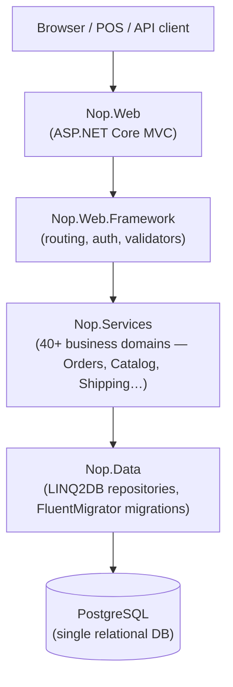
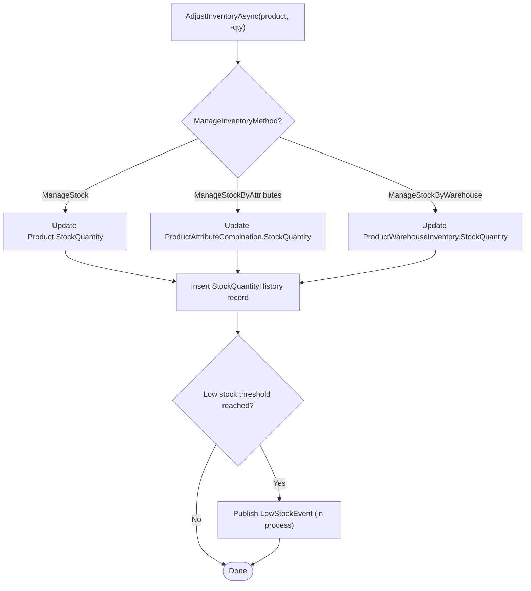
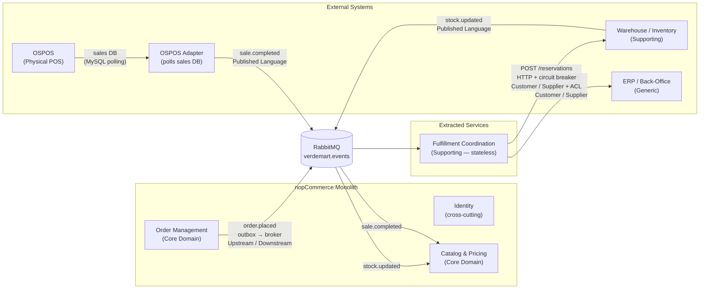
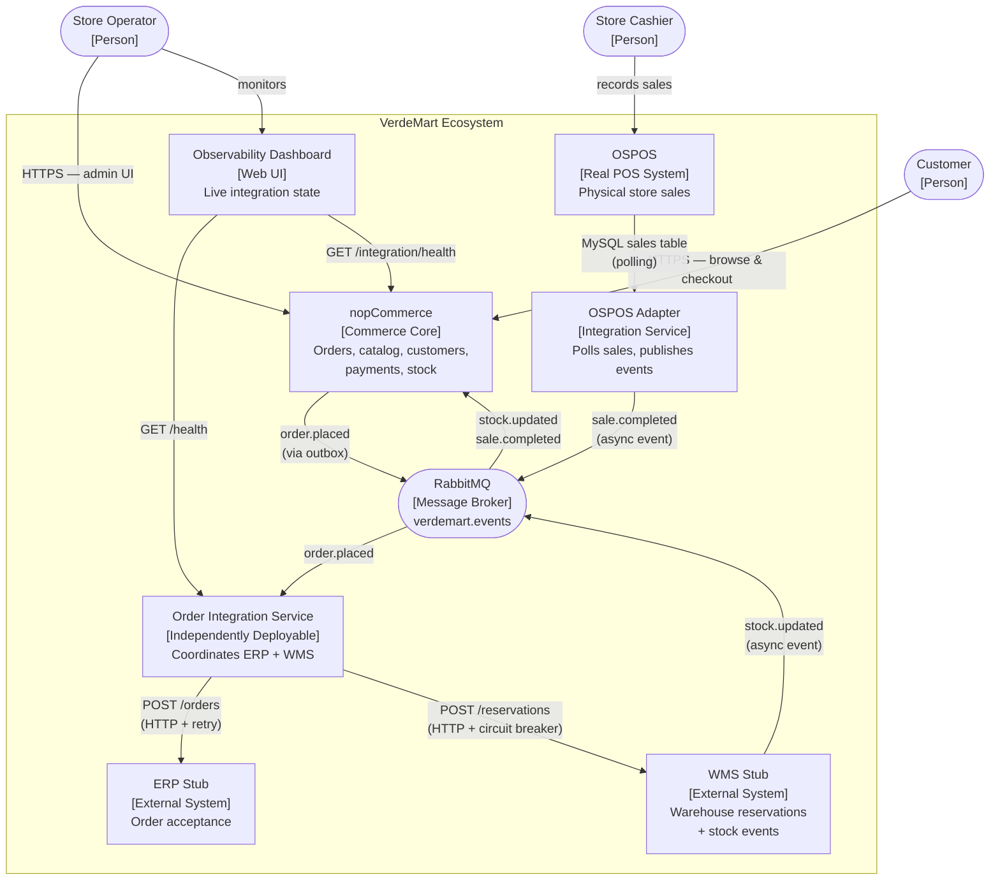
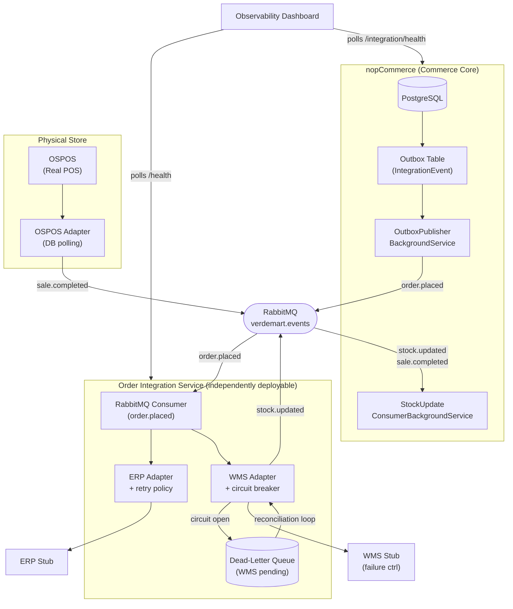
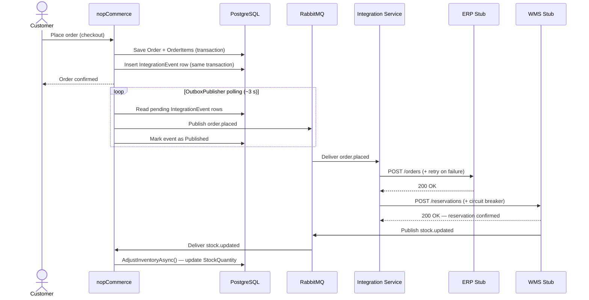
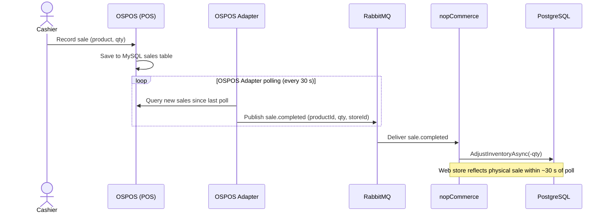
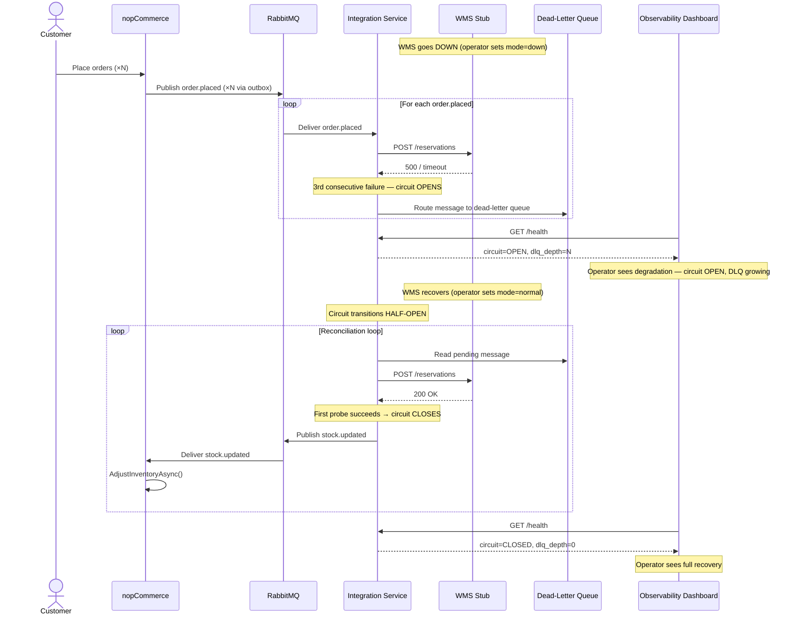
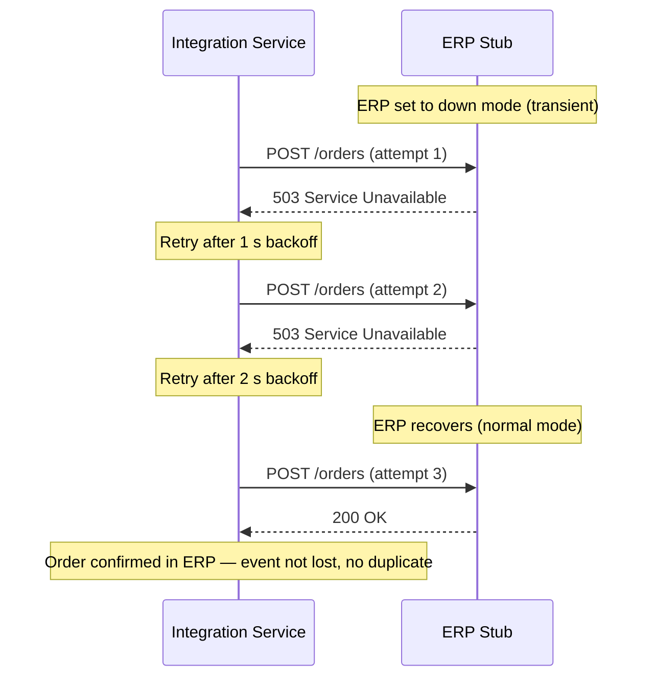
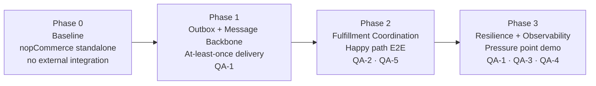

# Architecture Report — VerdeMart Omnichannel Commerce Core

**Scenario C — Architectural Evolution of nopCommerce**  
Software Architectures · MEI · Universidade de Aveiro  
Team: Henrique, Martim, Duarte, Sebastião

---

## 1. Executive Summary

VerdeMart is a retail business operating across three channels: a web store, physical retail stores, and a centralised warehouse. The existing technology stack centres on **nopCommerce 5.00** — a mature, open-source ASP.NET Core e-commerce platform. In its baseline form, nopCommerce operates as a self-contained storefront: it manages its own inventory, accepts orders, and processes payments with no awareness of the physical world.

The architectural problem is one of **integration under failure**. When a customer places an online order, the warehouse must reserve the stock and the ERP must record the sale. But warehouses go down, ERPs have transient failures, and physical store sales happen independently of the web. The system must remain useful under these conditions, make degradation visible to operators, and recover automatically when dependencies return.

This report documents how nopCommerce evolves from an isolated storefront into the **commerce core** of a wider operational ecosystem — connected to an ERP, a warehouse management system (WMS), and a physical point-of-sale (OSPOS) — while preserving the existing monolith and adding only the integration boundary required to solve the stated problem.

**Design method:** Attribute-Driven Design (ADD). Every structural decision is traceable to a measurable quality attribute scenario.

---

## 2. Business Context and Scenario

### 2.1 VerdeMart Scenario

| Actor | Role |
|-------|------|
| Online customer | Places orders through the nopCommerce web store |
| Store cashier | Records sales at the physical point-of-sale terminal (OSPOS) |
| Store operator | Monitors system health and integration state via the observability dashboard |

**Mandatory use cases:**

- **UC1 — Buy online, fulfill through another channel**: A customer places an order on the web store. The ERP must record the order for accounting. The WMS must reserve the stock in the warehouse and publish a stock correction back to nopCommerce.
- **UC2 — Cross-channel stock visibility**: A product sold in the physical store reduces warehouse stock. nopCommerce must reflect the updated quantity on the web store within a bounded time window, preventing overselling.

**Mandatory pressure point**: The WMS becomes unavailable during a period of order activity. nopCommerce must continue accepting and confirming customer orders. The integration layer must queue undeliverable messages, make the degradation visible, and automatically reconcile when the WMS returns — without manual intervention.

### 2.2 Business Drivers

1. **Unified commerce across channels** — customers expect consistent stock information and order state whether they shop online or in-store.
2. **Operational resilience** — a warehouse or ERP outage must not cause customer-facing order failures.
3. **Real-time stock accuracy** — overselling across channels is a direct revenue and trust problem.
4. **Fulfillment traceability** — operations staff must be able to trace an order from web placement through warehouse pick/pack.

---

## 3. Quality Attribute Scenarios

The architecture is driven by five concrete scenarios. Every major structural decision maps back to at least one of these.

### QA-1 — Availability: WMS Unavailable During Order Peak

| Field | Value |
|-------|-------|
| Source | Customer placing an order on the web store |
| Stimulus | WMS service becomes unavailable (network partition or crash) |
| Environment | Normal operating hours; 10 concurrent orders/minute |
| Artifact | Order Integration Service + nopCommerce outbox |
| Response | Order accepted and confirmed; event queued; WMS not contacted synchronously |
| Measure | 0% order failures attributable to WMS; all queued events delivered within 60 s of WMS recovery |

### QA-2 — Consistency: Cross-Channel Stock Visibility

| Field | Value |
|-------|-------|
| Source | Physical store POS (OSPOS) |
| Stimulus | A product is sold in-store, reducing warehouse stock |
| Environment | Normal operating condition; RabbitMQ healthy |
| Artifact | WMS stub → RabbitMQ → nopCommerce stock consumer |
| Response | nopCommerce product stock quantity updated to reflect the new warehouse level |
| Measure | Stock update visible in nopCommerce web store within 30 s of WMS event |

### QA-3 — Recoverability: WMS Returns After Outage

| Field | Value |
|-------|-------|
| Source | Operator (WMS service restarts) |
| Stimulus | WMS switches from `down` mode to `normal` mode |
| Environment | 5 orders accumulated in dead-letter queue during outage |
| Artifact | Integration Service reconciliation loop + circuit breaker |
| Response | Circuit resets; dead-letter queue drained; all 5 orders sent to WMS; stock updates published |
| Measure | All queued orders processed within 60 s of WMS recovery; no duplicate stock adjustments |

### QA-4 — Observability: Degradation Visible to Operator

| Field | Value |
|-------|-------|
| Source | Operator monitoring the dashboard |
| Stimulus | WMS becomes slow (> 5 s response time) |
| Environment | Normal operating hours |
| Artifact | Integration Service health endpoint + observability dashboard |
| Response | Dashboard shows circuit breaker state as `OPEN` or `HALF_OPEN`, DLQ depth increasing |
| Measure | State change visible on dashboard within 5 s of first WMS timeout |

### QA-5 — Reliability: ERP Transient Failure Recovery

| Field | Value |
|-------|-------|
| Source | Integration Service processing an `order.placed` event |
| Stimulus | ERP returns 503 for two consecutive requests before recovering |
| Environment | Transient ERP failure lasting under 30 s |
| Artifact | `ErpAdapter` + Polly retry policy (3 attempts, exponential backoff) |
| Response | Retries automatically with backoff; order accepted by ERP on third attempt; no loss, no duplication |
| Measure | Order confirmed in ERP within 30 s; zero events lost; no duplicate ERP orders |

---

## 4. Current-State Analysis

### 4.1 Baseline Architecture

nopCommerce 5.00 is a **modular monolith** on ASP.NET Core 10.0. All components run in a single deployable unit (`Nop.Web`). Data access uses LINQ2DB against a single relational database (PostgreSQL).



There are no external system integrations in the baseline. nopCommerce manages its own inventory, orders, shipping, and customer records — entirely self-contained.

### 4.2 Order Placement Flow (Baseline)


### 4.3 Inventory Management (Baseline)



### 4.4 Pressure Points

| Pressure | Current behaviour | Required behaviour |
|----------|-------------------|--------------------|
| WMS unavailable | Order placed; stock reduced in nopCommerce DB only; WMS never notified | Orders queued; WMS notified when it recovers |
| Physical store sale | nopCommerce has no awareness; web stock shows stale quantity | WMS pushes stock update; nopCommerce reflects it within 30 s |
| ERP unreachable | Order confirmed; ERP has no record | Retry until ERP acknowledges; order not lost |
| Operator visibility | No integration state visible | Dashboard shows live circuit breaker state and DLQ depth |

### 4.5 Injection Points Available in the Monolith

| Seam | Location | What we inject |
|------|----------|----------------|
| Post-order-placed | `OrderProcessingService.PlaceOrderAsync()` | Write outbox event row in the same DB transaction |
| Stock update (inbound) | `ProductService.AdjustInventoryAsync()` | Accept corrections from WMS via new consumer |
| Health / observability | `Nop.Web` controller | Expose pending outbox count and last publish time |

---

## 5. Bounded Contexts and Domain Model

### 5.1 Context Classification

| Context | Type | Owns |
|---------|------|------|
| Order Management | Core Domain | Orders, order items, order status, outbox |
| Catalog & Pricing | Core Domain | Products, stock quantities, pricing |
| Fulfillment Coordination | Supporting | Coordination protocol between core and external systems |
| ERP / Back-Office | Generic | Confirmed order records for accounting |
| Warehouse / Inventory | Supporting | Physical stock and warehouse reservation state |

### 5.2 Context Map



### 5.3 Relationship Descriptions

**Order Management → Fulfillment Coordination: Upstream / Downstream**
nopCommerce defines and publishes the `order.placed` schema without knowledge of downstream consumers. The outbox pattern ensures the event is written atomically with the order — nopCommerce never waits for the Integration Service.

**Fulfillment Coordination → ERP: Customer / Supplier**
The Integration Service calls the ERP over HTTP with exponential-backoff retry. The ERP owns its data model; the Integration Service translates to it. ERP failure does not block order placement.

**Fulfillment Coordination → WMS: Customer / Supplier with Anti-Corruption Layer**
The Polly circuit breaker on the WMS adapter acts as the ACL — it absorbs WMS instability, opens after repeated failures, and routes undeliverable messages to the dead-letter queue rather than blocking order flow.

**WMS → Catalog & Pricing: Published Language**
The WMS publishes `stock.updated` events with a stable, well-defined schema. nopCommerce consumes these to correct web-visible stock quantities without coupling to WMS internals.

**OSPOS → Catalog & Pricing (via adapter): Published Language**
OSPOS lacks native event publishing. The OSPOS Adapter polls the OSPOS sales database and translates completed sales into `sale.completed` events. The same `StockUpdateConsumerBackgroundService` in nopCommerce handles both `stock.updated` and `sale.completed`.

### 5.4 Data Ownership

| Data | Authoritative Owner | How other contexts access it |
|------|---------------------|------------------------------|
| Orders and order items | nopCommerce — Order Management | Read-only; never written by external systems directly |
| Product stock quantity | nopCommerce — Catalog | Updated by `StockUpdateConsumerBackgroundService` on events |
| Warehouse reservation state | WMS Stub | Never read by nopCommerce directly |
| ERP order record | ERP Stub | Never read by nopCommerce directly |

**No shared database** across extracted boundaries. All cross-context communication is via events or explicit HTTP calls with well-defined contracts.

---

## 6. Target Architecture

### 6.1 C4 — Context Level



### 6.2 System Overview



### 6.3 Component Responsibilities

**nopCommerce (modified monolith)**
Owns the entire commerce domain — order lifecycle, customer data, product catalog, payment processing, and web-visible stock quantities.

New additions:
- `IntegrationEvent` outbox table (FluentMigrator migration)
- `OutboxPublisherBackgroundService` — polls pending outbox rows every ~3 s, publishes to RabbitMQ `verdemart.events`, marks as published
- `StockUpdateConsumerBackgroundService` — subscribes to `stock.updated` and `sale.completed`, calls `ProductService.AdjustInventoryAsync()`, implements OSPOS-priority conflict resolution
- `/integration/health` — reports pending outbox count and last publish timestamp

**Order Integration Service (new, independently deployable)**
Owns the coordination protocol between the commerce core and external operational systems. Stateless by design — no shared database, state lives in RabbitMQ.

- Consumes `order.placed` from RabbitMQ
- `ErpAdapter` — HTTP POST to ERP, exponential-backoff retry (Polly)
- `WmsAdapter` — HTTP POST to WMS, circuit breaker (Polly, opens after 3 failures); on open: routes to dead-letter queue
- Reconciliation loop — drains dead-letter queue when circuit transitions to half-open
- Publishes `stock.updated` to RabbitMQ after WMS confirms reservation
- `/health` — circuit breaker state, DLQ depth, last processed event

**ERP Stub** (`services/erp-stub/`)
Simulates ERP order acceptance. `POST /orders`, `POST /admin/mode {normal|down}`. In-memory state.

**WMS Stub** (`services/wms-stub/`)
Simulates warehouse reservation. `POST /reservations` — on success, publishes `stock.updated` to RabbitMQ. `POST /admin/mode {normal|slow|down}`. In-memory state with injectable failure.

**OSPOS** — Real open-source point-of-sale system. Cashier records sales; data stored in MySQL.

**OSPOS Adapter** (`services/ospos-adapter/`)
Polls OSPOS MySQL sales table every 30 s for new sales, transforms to `sale.completed` events, publishes to RabbitMQ. Tracks processed sale IDs for idempotency.

**Observability Dashboard** (`services/dashboard/`)
Single-page HTML/JS app polling `/health` endpoints every 2 s. Shows live circuit breaker state, WMS mode, outbox pending count, DLQ depth. Provides demo control buttons to flip WMS mode.

### 6.4 Synchronous vs Asynchronous Interactions

| Interaction | Pattern | Justification |
|-------------|---------|---------------|
| Order placement → outbox write | Synchronous (same DB transaction) | Atomicity: order and event written together or not at all |
| Outbox → RabbitMQ | Asynchronous (background polling) | Decouples order placement from broker availability |
| RabbitMQ → Integration Service | Asynchronous (push consumer) | Integration Service processes at its own pace |
| Integration Service → ERP | Synchronous HTTP + retry | ERP must confirm before the event is considered delivered |
| Integration Service → WMS | Synchronous HTTP + circuit breaker | Failure must be detected per-call to open the circuit |
| WMS → stock.updated | Asynchronous (push to RabbitMQ) | Cross-channel visibility decoupled from order flow |
| RabbitMQ → nopCommerce (stock consumer) | Asynchronous | nopCommerce applies corrections in background |

### 6.5 Reliability Mechanisms

| Mechanism | Where | What it handles |
|-----------|-------|-----------------|
| Outbox pattern | nopCommerce | Guarantees at-least-once delivery even if RabbitMQ is temporarily down |
| Retry with exponential backoff | Integration Service — `ErpAdapter` | Transient ERP failures (3 attempts) |
| Circuit breaker | Integration Service — `WmsAdapter` | WMS prolonged unavailability — prevents cascade, opens after 3 failures |
| Dead-letter queue | RabbitMQ `verdemart.dlx` | Preserves unprocessable messages during WMS outage |
| Reconciliation loop | Integration Service | Drains DLQ and resubmits to WMS after circuit reset |
| Idempotency on `eventId` | Integration Service | Prevents duplicate ERP orders on DLQ drain |

---

## 7. Runtime Interaction Diagrams

### 7.1 Happy Path — UC1: Buy Online, Fulfill Through Another Channel



### 7.2 UC2: Cross-Channel Stock Visibility (Physical Store Sale)



### 7.3 Pressure Point — WMS Unavailable → Recovery



### 7.4 ERP Transient Failure with Retry (QA-5)



---

## 8. Evolution Path

The architecture evolves in three phases, each addressing a distinct quality concern.



### Phase 0 — Baseline

nopCommerce runs standalone. The full order lifecycle is self-contained. No ERP, no WMS, no health endpoint. Stock is only decremented by nopCommerce itself.

### Phase 1 — Outbox and Message Backbone

**Goal:** decouple order placement from external system availability.

Changes to nopCommerce:
- `IntegrationEvent` entity and FluentMigrator migration
- Hook in `OrderProcessingService.PlaceOrderAsync()` — writes `order.placed` to outbox in the **same transaction** as the order
- `OutboxPublisherBackgroundService` — polls every ~3 s, publishes to RabbitMQ `verdemart.events`, marks as published
- `/integration/health` endpoint

Infrastructure:
- RabbitMQ exchange `verdemart.events` (topic)
- Dead-letter exchange `verdemart.dlx` → queue `verdemart.dead-letter`

**Critical constraint**: the outbox write must be atomic with the order write. A write after the transaction commits risks silent event loss on process crash.

**QA addressed:** QA-1.

### Phase 2 — Fulfillment Coordination (Happy Path)

**Goal:** connect the backbone to ERP and WMS; route stock corrections back to nopCommerce.

New: Order Integration Service, ERP Stub, WMS Stub.

Changes to nopCommerce:
- `StockUpdateConsumerBackgroundService` — subscribes to `stock.updated` and `sale.completed`, calls `ProductService.AdjustInventoryAsync()`

**QA addressed:** QA-2, QA-5.

### Phase 3 — Resilience and Pressure Point

**Goal:** make WMS failure visible, contained, and recoverable.

Changes to Integration Service:
- Circuit breaker exercised under failure: after 3 failures, circuit opens; messages go to dead-letter queue
- Reconciliation loop drains dead-letter queue on half-open transition; idempotent on `eventId`

New: Observability Dashboard.

**QA addressed:** QA-1 (WMS down does not block orders), QA-3 (recovery), QA-4 (degradation visible).

---

## 9. Architectural Decisions

### ADR-001 — Messaging Backbone: RabbitMQ over Apache Kafka

**Decision:** Use RabbitMQ as the message broker.

| Criterion | RabbitMQ | Kafka |
|-----------|----------|-------|
| Operational complexity | Low — single broker, standard queues | High — ZooKeeper/KRaft, partition management |
| Native dead-letter support | Yes — DLX out of the box | No — requires custom offset management |
| Message routing | Topic exchanges, per-message routing keys | Topics only |
| Per-message acknowledgement | Yes | Offset-based |
| Demo throughput requirement | Sufficient (< 1000 msg/s) | Overkill (designed for 100 k+ msg/s) |

Kafka's strengths — log compaction, massive throughput, consumer group replay — provide no benefit and significantly increase operational overhead for the scenario's load (~10 orders/minute demo load). RabbitMQ's dead-letter exchange directly supports the mandatory reliability requirement.

**Consequence:** If future scale requires Kafka, migration path exists: replace the outbox publisher and Integration Service consumer; event contract schemas remain unchanged.

---

### ADR-002 — Reliability Pattern: Transactional Outbox over Direct Publish

**Decision:** Use the Transactional Outbox Pattern.

Direct publish has a critical reliability gap:

```
BEGIN TRANSACTION
  INSERT Order
  INSERT OrderItems
  AdjustInventory
COMMIT                        ← order is saved
PublishAsync(order.placed)    ← WHAT IF THIS FAILS?
```

If RabbitMQ is unavailable or the process crashes between commit and publish, the order is saved but the event is **silently lost** with no recovery path.

The outbox pattern closes this gap:

```
BEGIN TRANSACTION
  INSERT Order
  INSERT OrderItems
  AdjustInventory
  INSERT IntegrationEvent (status = Pending)   ← atomic with order
COMMIT
  ↓
OutboxPublisherBackgroundService (polling loop)
  → reads Pending rows
  → publishes to RabbitMQ
  → marks Published on ACK
  → retries on failure (row stays Pending)
```

**Consequence:** At-least-once delivery — the Integration Service must be idempotent on `eventId`. Polling interval introduces < 5 s publish latency (acceptable).

---

### ADR-003 — Integration Service Runtime: .NET Worker Service over Python

**Decision:** Use .NET Worker Service (ASP.NET Core minimal API + `IHostedService`).

The key driver is **Polly**: circuit breaker and retry requirements are first-class in the .NET ecosystem. Polly's `CircuitBreakerPolicy` and `RetryPolicy` are battle-tested, reducing implementation risk for the most critical part of the assignment. The team's existing C# experience further reduces risk.

Python's `tenacity` library handles retries but lacks a clean circuit breaker abstraction comparable to Polly.

**Consequence:** `services/order-integration-service/` is a .NET 10 project. Idempotency uses an in-memory `HashSet<Guid>` on `eventId` (sufficient for demo; production would use a Redis set or persistent DB table).

---

### ADR-004 — External Systems: Real vs Stub

**Decision:** ERP → stub. WMS → stub. POS → real OSPOS.

The assignment brief explicitly permits surrogate simulators if they preserve the architectural pressure and failure behavior of the scenario. The WMS stub provides identical pressure (HTTP POST, event back to RabbitMQ), full failure injection (`POST /admin/mode`), and lightweight Docker deployment. A real OpenBoxes deployment would add ~2 GB and Java runtime with no demo value for the failure injection scenario.

**OSPOS is real** because:
1. OSPOS lacks native RabbitMQ support — the adapter polling pattern can only be demonstrated against a system we don't control.
2. Using the WMS stub to simulate POS sales would create artificial architectural coupling between warehouse and retail.
3. The cross-channel conflict resolution pattern is more credible against a genuine third-party system.

**Trade-off accepted:** OSPOS Adapter polling interval (30–60 s) introduces latency for UC2 cross-channel updates. This is within the QA-2 target of 30 s.

---

## 10. Integration Contracts

These schemas were fixed before implementation began to enable parallel development.

**Exchange:** `verdemart.events` (RabbitMQ topic exchange)  
**Dead-letter exchange:** `verdemart.dlx` → queue `verdemart.dead-letter`

### `order.placed` — nopCommerce → Integration Service

```json
{
  "eventId": "3fa85f64-5717-4562-b3fc-2c963f66afa6",
  "orderId": 123,
  "customerId": 456,
  "items": [
    { "productId": 789, "sku": "VM-001", "quantity": 2 }
  ],
  "totalAmount": 49.99,
  "occurredAt": "2026-05-10T14:00:00Z"
}
```

### `stock.updated` — WMS Stub → nopCommerce

```json
{
  "eventId": "7b2e1a9c-3d4f-4e5a-8b9c-1d2e3f4a5b6c",
  "productId": 789,
  "warehouseId": 1,
  "newStockQuantity": 45,
  "occurredAt": "2026-05-10T14:00:05Z"
}
```

### `sale.completed` — OSPOS Adapter → nopCommerce

```json
{
  "eventId": "9c4d2f1e-5a6b-4c7d-8e9f-2a3b4c5d6e7f",
  "productId": 789,
  "storeId": "store-lisbon-01",
  "quantitySold": 1,
  "saleId": 4201,
  "occurredAt": "2026-05-10T13:58:00Z"
}
```

### WMS Reservation — Integration Service → WMS Stub

```json
{
  "orderId": 123,
  "items": [{ "productId": 789, "quantity": 2 }]
}
```

---

## 11. Cross-Cutting Concerns

### Observability

Structured logging (Serilog) with `correlationId` and `orderId` propagated from the `order.placed` event through all downstream systems. Every log line in the Integration Service, ERP Stub, and WMS Stub references the originating `eventId`, enabling end-to-end trace reconstruction.

The observability dashboard polls `/health` endpoints every 2 s and provides:
- Circuit breaker state (CLOSED / OPEN / HALF_OPEN)
- Dead-letter queue depth
- WMS mode (normal / slow / down)
- Outbox pending count
- Last event published timestamp

### Idempotency

`IntegrationEvent.EventId` (UUID) is used as the RabbitMQ message ID. The Integration Service deduplicates incoming messages on `eventId` to prevent double-processing on retry or DLQ drain. `AdjustInventoryAsync` calls from the stock consumer are idempotent because stock corrections are absolute quantities (not deltas) from the WMS.

### What Stays Inside the Monolith

| Concern | Justification |
|---------|---------------|
| Order lifecycle (placement, payment, status) | Core domain — not decomposed |
| Product catalog and pricing | Core domain — not decomposed |
| Customer management | Core domain — not decomposed |
| Web-visible stock quantity | Owned by Catalog context; corrected via events, not direct writes |
| Outbox table | Must share the order transaction scope — cannot be external |
| Stock update consumer | Applies corrections to nopCommerce-owned data — must live inside the monolith |

The integration service boundary is the only extracted boundary. Everything else stays in the monolith because the architectural problem is at the integration edge, not inside the commerce domain.

---

## 12. Known Limitations

| Limitation | Impact | Why not addressed |
|------------|--------|-------------------|
| ERP has no circuit breaker or DLQ | Retry exhaustion on permanent ERP failure loses the event | ERP failure is not the mandatory pressure point; duplicating the WMS DLQ pattern adds no new architectural lesson |
| Outbox polling interval is ~3 s | Up to 3 s latency between order placement and event publication | Reducing it requires push-based CDC (out of scope) |
| WMS and ERP stubs are in-memory | Stub restart loses all recorded state | Stubs are demonstration fixtures; persistence adds complexity without architectural value |
| No inter-service authentication | Internal services communicate without auth tokens | All services run on a private Docker network; mTLS is orthogonal to the reliability patterns being demonstrated |
| Dashboard is poll-based (every 2 s) | State transitions may appear with up to 2 s delay | Simpler than WebSocket push; sufficient for demo |
| OSPOS polling interval 30–60 s | Physical store sales reflected with up to 60 s lag | Real production would use OSPOS webhooks or sub-second polling; interval is configurable and within QA-2 target |
| Idempotency uses in-memory HashSet | Does not survive Integration Service restart | Sufficient for demo; production requires Redis or persistent DB table |
| Cross-channel oversell window | Race between OSPOS sale and web checkout within the polling interval | Mitigation via priority rule (OSPOS > web order) and compensating cancellation; 30–60 s window acceptable for demo |

---

## 13. Evidence Pack

> **Status as of 2026-05-27:** implementation in progress. This section will be populated with measurements, screenshots, and log samples as the pressure point scenario is exercised. The targets below are from QA scenarios.

### Target Measurements

| Metric | Target | Status |
|--------|--------|--------|
| Order acceptance rate during WMS failure | 100% — zero order failures attributable to WMS | Pending |
| Time from WMS recovery to DLQ fully drained | < 60 s | Pending |
| Stock update lag (WMS event → nopCommerce web stock) | < 30 s | Pending |
| ERP retry recovery time | < 30 s after transient failure | Pending |
| Dashboard state refresh latency after circuit opens | < 5 s | Pending |
| Duplicate event protection on DLQ drain | Zero duplicate ERP orders | Pending |

### Failure Scenarios to Document

- **WMS permanently down** — DLQ grows indefinitely; expected behaviour, not a bug; circuit stays OPEN
- **ERP returns 503 twice then recovers** — retry backoff; order arrives on 3rd attempt; log shows 3 attempts with `correlationId`
- **nopCommerce restarts mid-outbox flush** — pending rows re-published on restart; at-least-once delivery; idempotency prevents duplicates in ERP
- **OSPOS sale concurrent with web order on last unit** — OSPOS sale wins (priority rule); web order cancelled with customer notification

### Feasibility Spike Result (Risk 1 — MITIGATED, 2026-05-04)

The outbox mechanism was proven end-to-end before full implementation:
- `IntegrationEvent` table created via FluentMigrator migration
- `SpikeOutboxPublisherTask` (nopCommerce `IScheduleTask`) polls outbox every 10 s
- `AppStartedEvent` consumer writes a test row on startup
- Message appeared in RabbitMQ `verdemart.events` exchange within 4 s
- Verified in RabbitMQ Management UI
- No DI registration errors; spike merged to `develop` via PR #1

**Residual risk after spike:** LOW — production implementation refines working spike code.

---

## 14. Setup and Run

> **Status:** to be completed once all services are Dockerized. The section below documents the intended startup procedure.

### Prerequisites

- Docker and Docker Compose (v2)
- Ports available: 5000 (nopCommerce), 5672/15672 (RabbitMQ), 5050 (Integration Service), 5051 (ERP Stub), 5052 (WMS Stub), 3000 (Dashboard)

### Start Everything

```bash
docker compose up --build
```

This starts nopCommerce + PostgreSQL + RabbitMQ + Integration Service + ERP Stub + WMS Stub + OSPOS + OSPOS Adapter + Observability Dashboard.

### Verify Startup

```bash
# nopCommerce integration health
curl http://localhost:5000/integration/health

# Integration Service health (circuit breaker state)
curl http://localhost:5050/health

# RabbitMQ management UI
open http://localhost:15672   # guest / guest
```

### Demo Pressure Point

1. Open the observability dashboard at `http://localhost:3000`
2. Place an order through the nopCommerce web store at `http://localhost:5000`
3. Verify order appears in ERP and stock is updated
4. Use the dashboard to set WMS → **DOWN**
5. Place 3–5 more orders — all confirmed to the customer instantly
6. Dashboard shows: circuit = **OPEN**, DLQ depth growing
7. Set WMS → **NORMAL** via dashboard
8. Within 60 s: circuit resets → DLQ drains → stock updates flow → dashboard shows circuit = **CLOSED**, DLQ = 0
