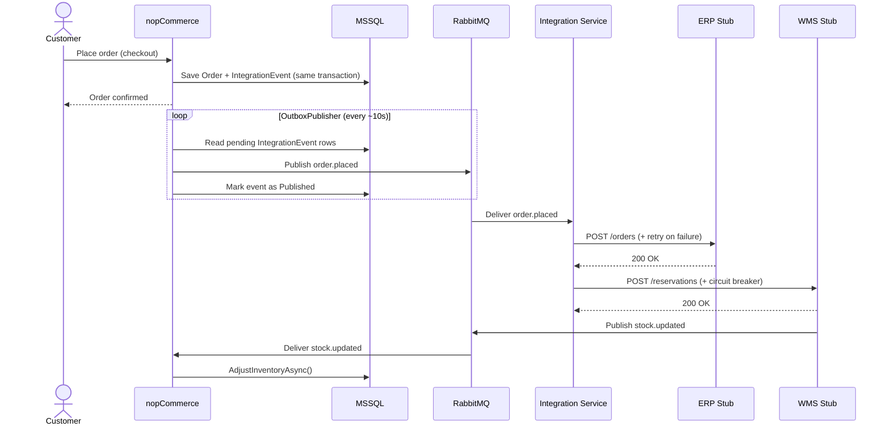
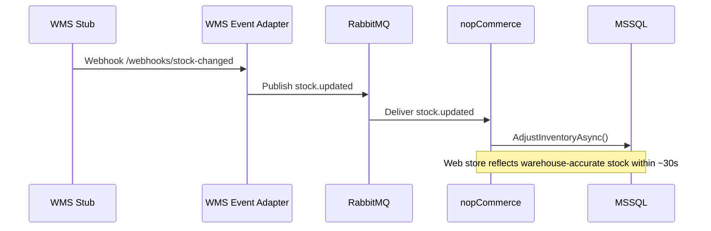
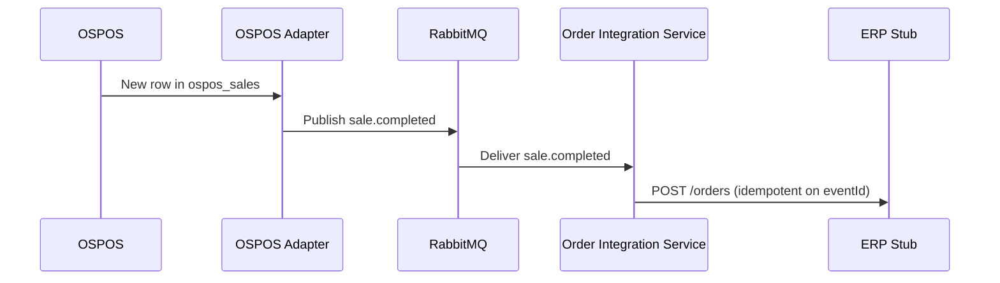
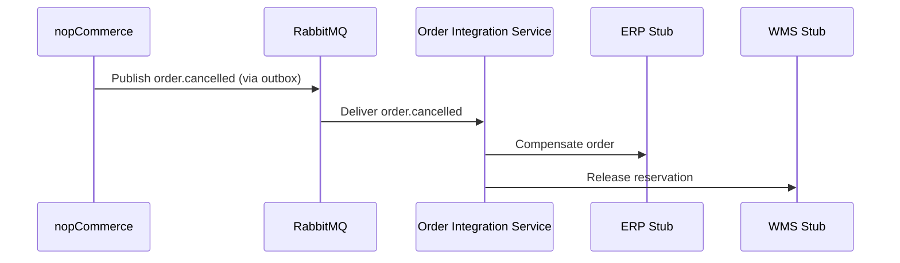

# Evolution Roadmap

**Scenario C - Omnichannel Commerce Core (VerdeMart Retail)**  
**Owner:** Duarte

---

## Starting Point and End Goal

**Current state:** nopCommerce operates as an isolated storefront - orders and stock are self-contained with no external system integration.

**Target state:** nopCommerce becomes the commerce core of a wider ecosystem: the ERP is notified on every order, the WMS is notified for stock reservation, in-store sales captured by OSPOS flow back as `sale.completed` events, cancellations propagate as `order.cancelled`, and stock corrections flow back automatically as `stock.updated`. If the WMS fails, the commerce core continues accepting orders and reconciles when it recovers.

**What does not change:** the entire nopCommerce core (catalog, checkout, customers, payments) remains inside the monolith. The architectural problem is at the integration boundary. The evolution adds a thin integration layer around the monolith rather than decomposing it.

---

## Phase 0 - Baseline (Current State)

nopCommerce runs as a standalone ASP.NET Core application backed by MSSQL (any LINQ2DB-supported relational DB works; MSSQL is the deployed default). The full order lifecycle - browse, cart, checkout, payment - is self-contained.

**Missing from the scenario:**
- No ERP is notified when an order is placed
- No WMS is contacted for stock reservation
- Stock quantities are only decremented by nopCommerce itself - no cross-channel correction
- No health endpoints or observability into integration state

---

## Phase 1 - Outbox and Message Backbone

**Goal:** decouple order placement from external system availability by introducing reliable event publication.

**Decisions captured:** [ADR-001](../adr/ADR-001-messaging-rabbitmq-vs-kafka.md) selects RabbitMQ as the broker; [ADR-002](../adr/ADR-002-reliability-outbox-vs-direct-publish.md) selects the transactional outbox pattern over direct publish.

**Changes to nopCommerce (implemented):**
- `IntegrationEvent` entity and FluentMigrator migration are in place
- `OrderProcessingService.PlaceOrderAsync()` writes `order.placed` to the outbox in the **same transaction** as the order; `order.cancelled` is written analogously on cancellation
- `OutboxPublisherTask` (nopCommerce `IScheduleTask`) polls every ~10s (seeded by `OutboxPublisherTaskMigration`), publishes pending events to RabbitMQ, marks them as published
- `/integration/health` reports pending outbox count and last publish timestamp

**Infrastructure:**
- RabbitMQ 3-management (AMQP `5672`, UI `15672`) - exchange `verdemart.events` (topic), dead-letter exchange `verdemart.dlx` -> queue `verdemart.dead-letter`
- Routing keys in use: `order.placed`, `sale.completed`, `stock.updated`, `order.cancelled`

**Coexistence:** nopCommerce (port `80`) remains fully operational without the Order Integration Service - events accumulate in the outbox and are delivered when a consumer appears.

**QA addressed:** QA-1 - order placement is decoupled from broker and downstream availability.

**Critical constraint:** the outbox write is atomic with the order write. A separate write after the transaction commits would risk silent event loss on crash.

---

## Phase 2 - Fulfillment Coordination (Happy Path)

**Goal:** connect the message backbone to ERP, WMS and OSPOS so that a placed order triggers fulfillment, in-store sales feed back into the commerce core, and stock corrections flow back.

**Decisions captured:** [ADR-003](../adr/ADR-003-integration-service-runtime.md) selects a .NET Worker runtime for the integration boundary; [ADR-004](../adr/ADR-004-wms-real-vs-stub.md) accepts a controllable WMS stub plus a dedicated event adapter in lieu of a real WMS for this delivery.

**Order Integration Service** (`services/order-integration-service/`, port `8083`)
- .NET 10 Worker; consumes `order.placed` and `sale.completed` from RabbitMQ
- `ErpAdapter` performs HTTP POST against the ERP stub with Polly retry (3 attempts, exponential backoff 1s/2s/4s)
- `WmsAdapter` performs HTTP POST against the WMS stub with a Polly circuit breaker (3 failures -> OPEN for 30s)
- On WMS success the service publishes `stock.updated` to RabbitMQ; on cancellation the upstream `order.cancelled` is consumed to compensate
- Exposes `/health`, `/dlq`, `/dlq/clear`, and `/webhooks/stock-changed`

**ERP Stub** (`services/erp-stub/`, port `8001`)
- Python FastAPI; `POST /orders`, `GET /orders`, `GET /health`, idempotency by `eventId`
- `POST /admin/mode` toggles `normal` | `down`; `POST /admin/reset` clears state

**WMS Stub** (`services/wms-stub/`, port `8002`)
- Python FastAPI; `POST /reservations`, `GET /reservations`, `GET /stock/{productId}`, `GET /health`, idempotency by `orderId`
- `POST /admin/mode` toggles `normal` | `slow` | `down`; `POST /admin/reset` clears state

**WMS Event Adapter** (`services/wms-event-adapter/`, port `8085`)
- Python FastAPI; receives warehouse stock-change webhooks at `POST /webhooks/stock-changed` and publishes `stock.updated` to RabbitMQ; `GET /health` reports liveness
- Note: superseded by the Order Integration Service `/webhooks/stock-changed` in the final wiring; kept available as a fallback path

**OSPOS** (`jekkos/opensourcepos` image, port `8080`, backed by `ospos_mysql`)
- Real point-of-sale used for in-store sales; not a stub

**OSPOS Adapter** (`services/ospos-adapter/`, no exposed port)
- .NET 10 Worker; polls `ospos_sales`, publishes `sale.completed` to RabbitMQ exchange `verdemart.events`
- SQLite idempotency store at `/app/data/idempotency.db`

**Changes to nopCommerce:**
- `StockUpdateConsumerBackgroundService` subscribes to `stock.updated` and calls `ProductService.AdjustInventoryAsync()` - the consumer is hosted inside the monolith because it writes to nopCommerce-owned inventory

**Happy path (UC1 - Buy-Online / Fulfill-Through-Another-Channel):**



**Cross-channel stock visibility (UC2):**



**In-store sales propagation (UC3):**



**Cancellation propagation:**



**QA addressed:** QA-2 - stock consistency across channels; UC1, UC2 and UC3 covered. QA-5 - ERP transient failure handled by `ErpAdapter` retry policy (3 attempts, exponential backoff).

---

## Phase 3 - Resilience and Pressure Point

**Goal:** make the WMS failure scenario visible, contained, and recoverable.

**Order Integration Service resilience (implemented):**
- Circuit breaker on `WmsAdapter` is configured with `handledEventsAllowedBeforeBreaking: 3` and `durationOfBreak: 30s`:
  - Design intent: after 3 consecutive failures the circuit opens for 30s, undeliverable payloads route to the DLQ, and a half-open probe re-closes it on the first success
  - Observed limitation: under sustained WMS 503s the breaker stayed `CLOSED` (see "Known Limitations" below and `docs/evidence/README.md`); the externally observable behaviour was preserved because every WMS-bound payload was captured by the DLQ and replayed on recovery
- `ReconciliationService` runs continuously and activates as soon as WMS calls start succeeding:
  - Drains `verdemart.dead-letter`, resubmits each `order.placed` to WMS
  - Publishes `stock.updated` for each successful reservation
  - Idempotent on `eventId` (UUID); the same path applies to `order.cancelled` compensations

**Observability Dashboard** (`services/dashboard/`, port `8090`)
- React + Vite SPA served by nginx; polls `/health` every 2s
- Displays live: circuit breaker state, WMS mode, outbox count, dead-letter depth, last `stock.updated`, `sale.completed` and `order.cancelled` traffic
- Control buttons flip WMS to `down` / `slow` / `normal` without touching the terminal

**Pressure point demo sequence (as observed in `docs/evidence/`):**
```text
1. Operator sets WMS -> DOWN via dashboard
2. Customers place N orders -> confirmed instantly, outbox fills
3. Order Integration Service: WMS calls return 503 -> every undeliverable payload routes to the DLQ
4. Dashboard: dlq_depth=N, wms_mode=down, status=degraded
   (design-intent circuit=OPEN; in the evidence run the breaker stayed CLOSED - see Known Limitations)
5. Operator sets WMS -> NORMAL via dashboard
6. Reconciliation loop drains DLQ -> all N reservations sent -> stock.updated published
7. Dashboard: dlq_depth=0, status=healthy
8. nopCommerce stock quantities correct (when the storefront is available)
```

**QA addressed:** QA-1 (WMS down does not block orders), QA-3 (recovery after outage), QA-4 (degradation visible to operator).

---

## Risks and Validation

Main architectural risks are tracked in [`docs/architecture/risk-plan.md`](risk-plan.md). Summary:

| Risk | Severity | Mitigation |
|------|----------|------------|
| Outbox hook into `OrderProcessingService` breaks nopCommerce DI | HIGH | Feasibility spike (Week 1) before full implementation |
| Circuit breaker timing wrong - demo unconvincing | MEDIUM | Integration tests against real Docker Compose stack (Week 3-4) + demo rehearsal (Week 5) |
| Docker Compose startup order causes demo failure | LOW-MEDIUM | `depends_on: condition: service_healthy` + smoke test script |

---

## Evidence to Capture

The following measurements support Part 2 evaluation and demonstrate quality attribute improvements:

| Metric | Target | How measured |
|--------|--------|--------------|
| Order acceptance rate during WMS failure | 100% - zero order failures attributable to WMS | Place N orders with WMS in `down` mode; count confirmed orders |
| Time from WMS recovery to DLQ fully drained | < 60 s | Timestamp WMS -> `normal` transition; timestamp last `stock.updated` published from DLQ |
| Stock update lag (WMS event -> nopCommerce web stock) | < 30 s | Trigger `stock.updated` from WMS stub; record elapsed time until nopCommerce product reflects new quantity |
| ERP retry recovery time | < 30 s after transient failure | Set ERP to `down` for 20 s; verify order appears in ERP; check retry log timestamps |
| Dashboard state refresh latency | < 5 s after circuit opens | Timestamp first WMS timeout; timestamp dashboard showing `OPEN` |
| Duplicate event protection | Zero duplicate ERP orders on DLQ drain | Drain DLQ after recovery; verify ERP has exactly N orders (not 2N) |

**Failure scenarios to document:**
- WMS permanently down (DLQ grows indefinitely - expected, not a bug)
- ERP returns 503 twice then recovers (retry backoff; order arrives on 3rd attempt)
- nopCommerce restarts mid-outbox flush (events re-published on restart - at-least-once, idempotency prevents duplicates)

---

## Known Limitations

| Limitation | Impact | Reason not addressed |
|------------|--------|----------------------|
| ERP has no circuit breaker or dead-letter queue | If ERP is permanently down, retry exhaustion loses the event | ERP failure is not the mandatory pressure point; adding DLQ for ERP would duplicate the WMS pattern without adding a new architectural lesson |
| Outbox polling interval is ~10 s | Up to ~10 s latency between order placement and event publication | Acceptable for the scenario; reducing it would require push-based change data capture (CDC), which is out of scope |
| WMS and ERP stubs are in-memory | A stub restart loses all recorded reservations and orders | Stubs are demonstration fixtures, not production services; persistence would add complexity without architectural value |
| No inter-service authentication | Internal services communicate without auth tokens | All services run on a private Docker network; adding auth (e.g., mTLS) is a cross-cutting concern orthogonal to the reliability patterns being demonstrated |
| Dashboard is poll-based (every 2 s) | State transitions may appear with up to 2 s delay | Simpler than WebSocket push; sufficient for demo purposes |
| Polly circuit breaker on `WmsAdapter` did not transition to OPEN under sustained WMS 503s | Externally indistinguishable from "breaker open then drain" because the DLQ caught every failure; circuit-breaker state metric was therefore inconclusive | Root cause: `AddHttpClient<T>.AddPolicyHandler` rebuilds the typed-client handler chain per scope, so the breaker state object is not shared across calls (see `docs/evidence/README.md`) |
| nopCommerce container exited with status 139 during MSSQL EF init in the evidence run | Storefront and admin UI not available for the live demo; consumer side of QA-5 deferred | Documented in `docs/evidence/README.md`; the rest of the bus was healthy and the producer leg of QA-5 was verified via the WMS Event Adapter |

---

## Transition Constraints

| Constraint | Applies to | Reason |
|------------|-----------|--------|
| nopCommerce must remain fully functional if Integration Service is not running | Phase 1 -> 3 | Outbox buffers events; customer experience must not depend on downstream availability |
| No shared database across service boundaries | Phase 2 -> 3 | ERP and WMS stubs have their own state; nopCommerce MSSQL is never accessed externally |
| Outbox write must be atomic with the order write | Phase 1 -> 3 | A crash between order save and event write produces a silent lost event |
| `eventId` must be propagated end-to-end | Phase 2 -> 3 | Required for idempotent reconciliation and log correlation across service boundaries |
| Integration Service must not hold shared mutable state in memory | Phase 2 -> 3 | Multiple instances must be possible; state belongs in RabbitMQ (DLQ) or the circuit breaker policy |

---

## What Remains Inside the Monolith

| Concern | Justification |
|---------|---------------|
| Order lifecycle (placement, payment, status) | Core domain - not decomposed |
| Product catalog and pricing | Core domain - not decomposed |
| Customer management | Core domain - not decomposed |
| Stock quantity (web-visible) | Owned by Catalog context; corrected via events, not direct writes |
| Outbox table | Must share the order's transaction scope - cannot be external |
| Stock update consumer | Applies corrections to nopCommerce-owned data; must live inside the monolith |

The integration service boundary is the only extracted boundary. Everything else stays in the monolith because the architectural problem is at the integration edge, not inside the commerce domain.
