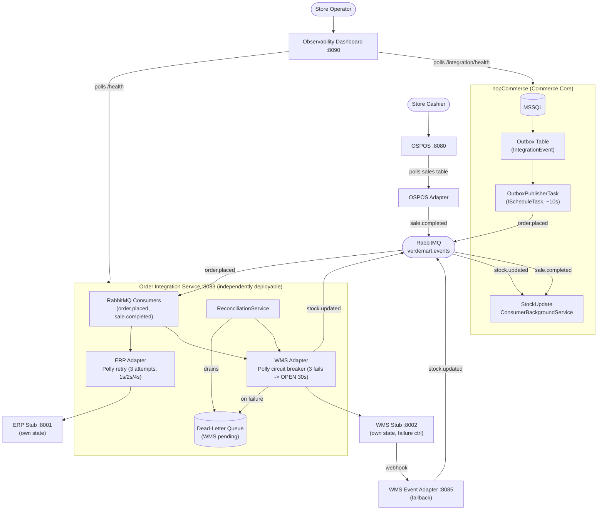
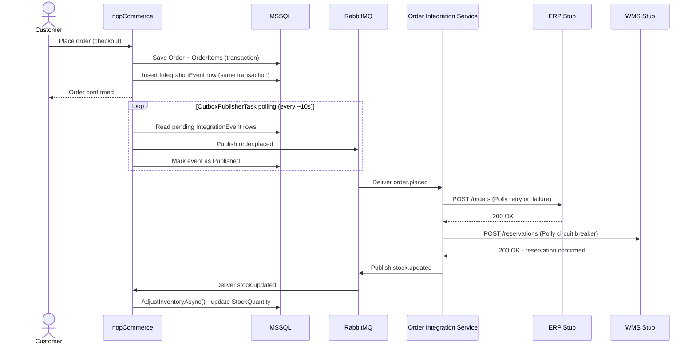
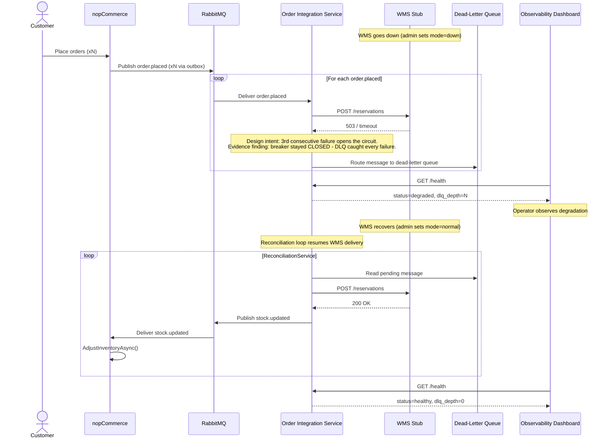
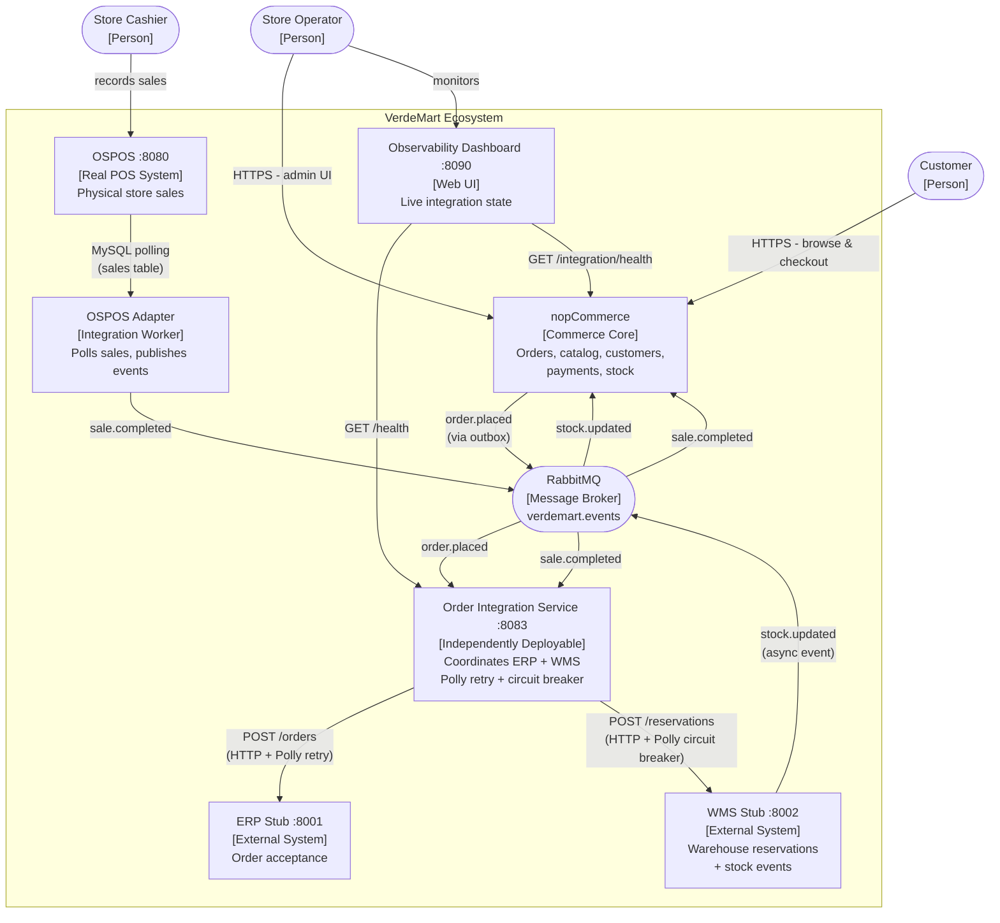

# Target Architecture

**Scenario C - Omnichannel Commerce Core (VerdeMart Retail)**

## 1. Architecture Overview

nopCommerce evolves from an isolated web storefront into the commerce core of a wider operational ecosystem. The monolith is minimally modified - only the integration boundary is added. Surrounding systems communicate through a message broker (RabbitMQ) rather than direct calls.



## 2. Component Responsibilities

### nopCommerce (modified monolith)
- Owns: order lifecycle, customer data, product catalog, payment processing, stock quantities.
- `IntegrationEvent` outbox table (FluentMigrator migration).
- `OutboxPublisherTask` - polls pending outbox rows, publishes to the RabbitMQ `verdemart.events` exchange, marks rows as published.
- `StockUpdateConsumerBackgroundService` - subscribes to `stock.updated` and `sale.completed` routing keys, calls `ProductService.AdjustInventoryAsync()`, and applies cross-channel conflict resolution (OSPOS sales prioritised over web orders).
- `/integration/health` - reports pending outbox count and last publish time.

### Order Integration Service (.NET 10 worker, port 8083)
- Owns: coordination between nopCommerce events and external operational systems.
- Consumes `order.placed` and `sale.completed` from RabbitMQ.
- Forwards orders to the ERP stub through an ERP adapter wrapped in a Polly retry policy (3 attempts, exponential backoff 1s/2s/4s).
- Forwards reservations to the WMS stub through a WMS adapter wrapped in a Polly circuit breaker (3 consecutive failures open the circuit for 30s).
- On WMS failure, routes the message to the in-process dead-letter queue.
- `ReconciliationService` drains the dead-letter queue once the WMS recovers.
- Maintains a `HealthState` projection and exposes `/health`, `/dlq`, `/dlq/clear`, and `/webhooks/stock-changed`.

### ERP Stub (`services/erp-stub/`, Python FastAPI, port 8001)
- Simulates ERP order acceptance with idempotency by `eventId`.
- `POST /orders`, `GET /orders` - stores and reads confirmations in-memory.
- `POST /admin/mode` - toggles `normal` or `down` for demo pressure points.
- `POST /admin/reset`, `GET /health`.

### WMS Stub (`services/wms-stub/`, Python FastAPI, port 8002)
- Simulates warehouse reservation with idempotency by `orderId`.
- `POST /reservations`, `GET /reservations` - accepts and reads reservations.
- `GET /stock/{productId}` - returns current warehouse stock.
- `POST /admin/mode` - toggles `normal`, `slow`, or `down` for demo pressure points.
- `POST /admin/reset`, `GET /health`.

### WMS Event Adapter (`services/wms-event-adapter/`, Python FastAPI, port 8085)
- `POST /webhooks/stock-changed`, `GET /health`.
- Note: superseded by the Order Integration Service `/webhooks/stock-changed` in the final wiring; kept available as a fallback path.

### OSPOS (jekkos/opensourcepos image, port 8080)
- Real open-source point-of-sale system (not a stub) backed by `ospos_mysql` (MySQL 5.7).
- Cashiers record sales at the terminal; sales land in the OSPOS MySQL database.
- Product catalogue is synchronised with nopCommerce.

### OSPOS Integration Adapter (`services/ospos-adapter/`, .NET 10 worker)
- Polls the `ospos_sales` table for new sales (no exposed port).
- Transforms each sale into a `sale.completed` event and publishes it to the RabbitMQ `verdemart.events` exchange.
- Tracks processed sale IDs in a SQLite database at `/app/data/idempotency.db`.

### Observability Dashboard (`services/dashboard/`, React + Vite, port 8090, nginx-served)
- Polls `/health` from the Order Integration Service and `/integration/health` from nopCommerce every 2s.
- Shows live circuit-breaker state, WMS mode, pending outbox count, and dead-letter queue depth.
- Provides demo control buttons to flip WMS between `down`, `slow`, and `normal`.

## 3. Data Ownership

| Data | Owner | Shared? |
|------|-------|---------|
| Orders, order items | nopCommerce MSSQL | No - integration only via events |
| Product catalog, stock quantities | nopCommerce MSSQL | No - WMS pushes updates via events |
| Customer data | nopCommerce MSSQL | No |
| Fulfillment confirmations | ERP stub (in-memory) | No |
| Warehouse reservations | WMS stub (in-memory) | No |
| OSPOS sales | OSPOS MySQL | No - Adapter republishes as events |
| OSPOS Adapter idempotency | SQLite (`/app/data/idempotency.db`) | No |
| Integration events (outbox) | nopCommerce MSSQL | No - internal only |

No shared database crosses the extracted integration service boundary.

## 4. Synchronous vs Asynchronous Interactions

| Interaction | Pattern | Justification |
|-------------|---------|---------------|
| Order placement to outbox write | Synchronous (same DB transaction) | Atomicity: order and event are written together |
| Outbox to RabbitMQ | Asynchronous (background task, polling) | Decouples order placement from broker availability |
| RabbitMQ to Order Integration Service | Asynchronous (push consumer) | The service processes at its own pace |
| Order Integration Service to ERP | Synchronous HTTP with Polly retry | ERP must confirm before progressing |
| Order Integration Service to WMS | Synchronous HTTP with Polly circuit breaker | Failure must be detected per-call to trip the breaker |
| WMS to `stock.updated` | Asynchronous (push to RabbitMQ) | Cross-channel visibility decoupled from the order flow |
| RabbitMQ to nopCommerce (stock consumer) | Asynchronous | The monolith applies stock updates in the background |

## 5. Reliability Decisions

| Decision | Mechanism | What it handles |
|----------|-----------|-----------------|
| Outbox pattern | DB table + `OutboxPublisherTask` | Guarantees at-least-once delivery even when RabbitMQ is temporarily down |
| Retry with backoff | Polly `RetryPolicy` on the ERP adapter (3 attempts, 1s/2s/4s) | Transient ERP failures |
| Circuit breaker | Polly `CircuitBreakerPolicy` on the WMS adapter (3 failures, OPEN 30s) | Prolonged WMS unavailability - prevents cascade |
| Dead-letter queue | In-process DLQ inside the Order Integration Service | Preserves unprocessable messages for reconciliation |
| Reconciliation loop | `ReconciliationService` | Drains the DLQ once the WMS recovers |

## 6. Cross-Cutting Concerns

- Observability: structured logging (Serilog) with `correlationId` propagated from `order.placed` through all downstream systems. The dashboard surfaces live state.
- Idempotency: `IntegrationEvent.EventId` (UUID) is used as the RabbitMQ message ID; the Order Integration Service deduplicates on `eventId` to prevent double-processing on retry; the WMS stub deduplicates by `orderId`; the OSPOS Adapter tracks processed sale IDs in SQLite.
- Traceability: every integration event carries `orderId` and `eventId`; logs in the Order Integration Service correlate WMS and ERP calls back to the originating order.

## 7. Runtime Sequence - Happy Path (Use Case 1: Buy-Online / Fulfill-Through-Another-Channel)



## 8. Runtime Sequence - Pressure Point (WMS Unavailable -> Recovery)



## 9. C4 - Context Level



## 10. Evolution Path (Current to Target)

```
Step 1  Add IntegrationEvent table migration + outbox writer hook in OrderProcessingService
Step 2  Add OutboxPublisherTask (polls + publishes to RabbitMQ)
Step 3  Build the Order Integration Service skeleton + RabbitMQ consumer
Step 4  Build the ERP stub + WMS stub (Dockerized)
Step 5  Deploy OSPOS + build the OSPOS Integration Adapter
Step 6  Add the ERP adapter + Polly retry policy in the Order Integration Service
Step 7  Add the WMS adapter + Polly circuit breaker + dead-letter queue + reconciliation
Step 8  Add StockUpdateConsumerBackgroundService in nopCommerce + cross-channel conflict resolution
Step 9  Add the observability dashboard + health endpoints
Step 10 Demonstrate the pressure point: WMS down, orders queue, WMS up, reconcile
```

## 11. What Remains Inside the Monolith and Why

The entire nopCommerce core (catalog, orders, customers, payments, checkout) stays inside the monolith because:
- it is already well-factored as a modular monolith with a clean service layer;
- the architectural problem sits at the integration boundary, not inside the commerce domain;
- rewriting the monolith would not satisfy the selective-evolution constraint and would produce an inflated, undefensible design;
- the outbox pattern and background consumers are standard monolith-friendly patterns that require minimal invasive changes.
