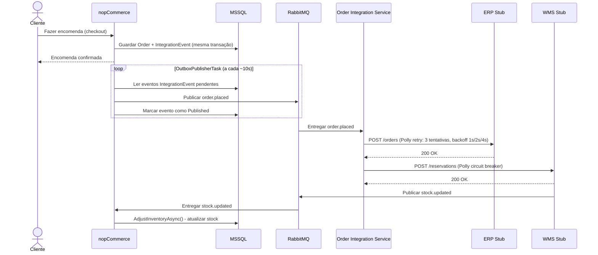
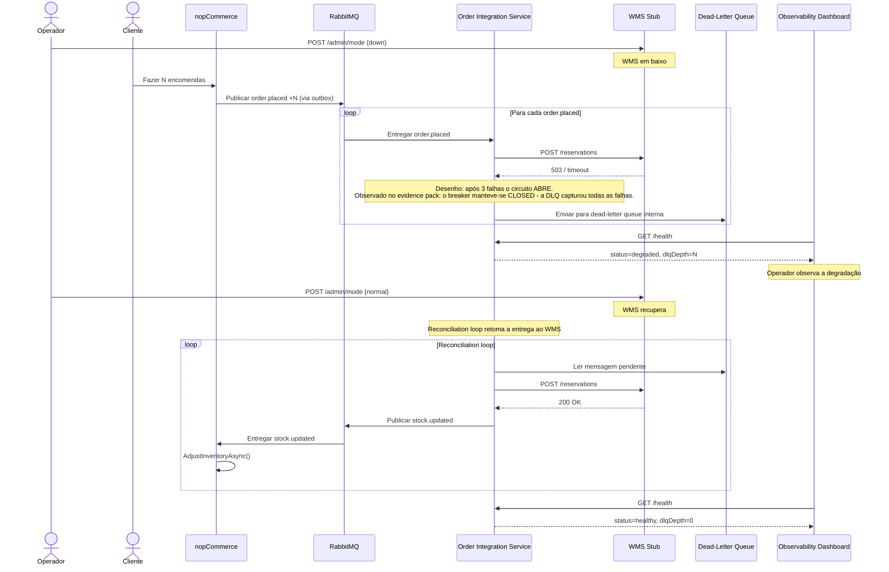

# Resumo do Projeto - Arquiteturas de Software

**Disciplina:** Arquiteturas de Software - Mestrado em Engenharia Informática  
**Docente:** Cláudio Teixeira (claudio@ua.pt)  
**Grupo:** Henrique, Martim, Duarte, Sebastião  
**Peso:** 50% da nota final  
**Cenário escolhido:** Cenário C - Omnichannel Commerce Core (VerdeMart Retail)

---

## 1. O que é este projeto

Este é o Trabalho de Grupo 2 da disciplina de Arquiteturas de Software. O objetivo **não** é construir uma aplicação nova do zero. O objetivo é pegar num sistema real já existente - o **nopCommerce** - e fazê-lo evoluir arquiteturalmente para responder a um cenário de negócio exigente.

A avaliação centra-se em:

- A qualidade das **decisões arquiteturais** e a sua justificação
- A **rastreabilidade** dessas decisões (desde os requisitos de negócio até ao código)
- A capacidade de demonstrar o sistema a funcionar **sob pressão** (falhas, atrasos, recuperação)

O trabalho divide-se em duas partes:

| Parte | Data | Formato | Peso |
|-------|------|---------|------|
| Parte 1 - Architecture Checkpoint | 5-6 de maio de 2026 | Apresentação de 7 minutos | 20% |
| Parte 2 - Entrega Final + Demo | 2-3 de junho de 2026 | Apresentação de 15 minutos com demo ao vivo | 80% |

---

## 2. O que é o nopCommerce

O **nopCommerce** é uma plataforma de e-commerce open-source, escrita em C# com ASP.NET Core 10.0. É um **monólito modular** com uma estrutura em camadas (onion-style):

```
src/Libraries/
  Nop.Core/       - Entidades de domínio (BaseEntity), caching, eventos, helpers
  Nop.Data/       - ORM (LINQ2DB), migrações (FluentMigrator), suporte multi-BD
  Nop.Services/   - 40+ serviços de negócio (Catalog, Orders, Customers, Logging, etc.)

src/Presentation/
  Nop.Web.Framework/  - Infraestrutura MVC partilhada: routing, auth, validators
  Nop.Web/            - Ponto de entrada ASP.NET Core; controllers, Razor views, Program.cs

src/Plugins/        - 30+ plugins dinâmicos (Pagamentos, Expedição, Impostos, Widgets, etc.)
```

No estado base (sem modificações), o nopCommerce:
- Gere o ciclo de vida completo das encomendas (carrinho -> checkout -> pagamento -> confirmação)
- Gere o catálogo de produtos, preços e descontos
- Controla o stock internamente, na sua própria base de dados
- **Não comunica com nenhum sistema externo** - é completamente autónomo

É exatamente este isolamento que o cenário escolhido pretende resolver.

---

## 3. O Cenário Escolhido - Cenário C: Omnichannel Commerce Core

### 3.1 O contexto fictício

A empresa fictícia **VerdeMart Retail** começou com o nopCommerce como loja online. À medida que o negócio cresceu, passou a ter também lojas físicas, um armazém, um sistema ERP para faturação e um sistema de gestão de armazém (WMS). Agora, todos estes sistemas precisam de funcionar em conjunto.

O problema arquitetural não é simplesmente "ligar mais sistemas". O problema é: **como é que o nopCommerce se comporta quando um desses sistemas externos falha, atrasa ou fica indisponível?**

### 3.2 Os dois casos de uso obrigatórios

O enunciado exige a demonstração de dois casos de uso:

**Caso de uso 1 - Compra online / fulfillment por outro canal:**
- O cliente compra na loja online (nopCommerce)
- O ERP é notificado para registo financeiro e faturação
- O WMS é notificado para reserva de stock no armazém
- O nopCommerce confirma a encomenda ao cliente sem esperar pelos sistemas externos

**Caso de uso 2 - Visibilidade de stock entre canais:**
- Uma venda na loja física (OSPOS) reduz o stock no armazém
- O evento `sale.completed` é publicado pelo OSPOS Adapter
- O nopCommerce reflete automaticamente o novo nível de stock
- O cliente na loja online vê o stock atualizado

### 3.3 Os três pontos de pressão

O Cenário C destila-se em três pontos de pressão concretos, que conduzem todas as decisões estruturais:

- **Lost Sales.** A indisponibilidade do WMS não pode bloquear a aceitação de encomendas. As encomendas ficam em fila local e sincronizam quando o sistema recupera. Mapeia para QA-1 (Disponibilidade) e para a táctica outbox / DLQ / reconciliation.
- **Overselling.** Alterações de stock em lojas físicas têm de se reflectir no site em segundos, prevenindo overselling. Mapeia para QA-2 (Consistência) e para o consumer de `stock.updated` no nopCommerce.
- **Operational Blindness.** Toda a encomenda online tem de chegar ao ERP e ao WMS de forma fiável, com rastreabilidade completa entre fronteiras de sistemas. Mapeia para QA-4 (Observabilidade) e QA-5 (Fiabilidade), e para o endpoint `/health` do Order Integration Service e o dashboard.

### 3.4 O ponto de pressão obrigatório

O enunciado exige ainda a demonstração de uma falha real com recuperação:

> O WMS fica indisponível. O nopCommerce continua a aceitar encomendas. As mensagens acumulam-se numa dead-letter queue interna. Quando o WMS recupera, todas as encomendas são processadas automaticamente pelo reconciliation loop - sem perda de dados e sem intervenção manual.

A demonstração mostra:
1. Como a degradação se torna visível (dashboard, `/health`, `/dlq`)
2. Como a arquitetura isola e contém o problema (bulkhead entre ERP e WMS, circuit breaker, dead-letter queue)
3. Como o sistema recupera (reconciliation loop drena a DLQ assim que o WMS volta ao modo `normal`)

---

## 4. A Arquitetura Alvo - Como o Sistema Funciona

### 4.1 Visão geral

O nopCommerce mantém-se como monólito central - **não é decomposto em microserviços**. O que muda é a sua **fronteira de integração**: é adicionada uma camada fina de integração assíncrona que desacopla o nopCommerce dos sistemas externos.

Os componentes da entrega final são:

| Componente | Tecnologia | Porta | Responsabilidade |
|-----------|-----------|-------|-----------------|
| nopCommerce | ASP.NET Core + MSSQL | 80/443 | Commerce core - encomendas, catálogo, clientes, pagamentos; tabela outbox; `OutboxPublisherTask`; `StockUpdateConsumerBackgroundService`; `/integration/health` |
| RabbitMQ | `rabbitmq:3-management` | 5672 / 15672 | Corretor de mensagens; exchange `verdemart.events`; routing keys `order.placed`, `sale.completed`, `stock.updated`, `order.cancelled` |
| Order Integration Service | .NET 10 Worker | 8083 | Coordenação entre nopCommerce e ERP/WMS; consumidores `order.placed` e `sale.completed`; `/health`, `/dlq`, `/dlq/clear`, `/webhooks/stock-changed` |
| ERP Stub | Python FastAPI | 8001 | `POST /orders`, `GET /orders`, `POST /admin/mode {normal,down}`, `POST /admin/reset`, `GET /health`; idempotência por `eventId` |
| WMS Stub | Python FastAPI | 8002 | `POST /reservations`, `GET /reservations`, `GET /stock/{productId}`, `POST /admin/mode {normal,slow,down}`, `POST /admin/reset`, `GET /health`; idempotência por `orderId` |
| WMS Event Adapter | Python FastAPI | 8085 | `POST /webhooks/stock-changed`, `GET /health`. Mantido como fallback; o cabeamento final usa o endpoint equivalente no Integration Service |
| OSPOS | `jekkos/opensourcepos` | 8080 | Sistema de loja física |
| OSPOS MySQL | MySQL 5.7 | interno | Base de dados do OSPOS |
| OSPOS Adapter | .NET 10 Worker | sem porta exposta | Sondagem da tabela `ospos_sales`; publica `sale.completed`; idempotência em SQLite em `/app/data/idempotency.db` |
| Observability Dashboard | React + Vite (servido por nginx) | 8090 | Monitorização ao vivo do estado da integração |

### 4.2 O padrão Outbox (Transactional Outbox Pattern)

Este é o mecanismo central de fiabilidade do sistema. O problema que resolve é o seguinte.

**Sem outbox (problema):**
```
BEGIN TRANSACTION
  INSERT Order
  INSERT OrderItems
COMMIT TRANSACTION
v
PublishAsync(order.placed)  <- se isto falhar, a encomenda foi guardada mas o ERP/WMS nunca sabe
```

Se o RabbitMQ estiver indisponível no momento em que a encomenda é confirmada, o evento perde-se silenciosamente. O ERP e o WMS nunca recebem a notificação e não há forma de recuperar sem intervenção manual.

**Com outbox (solução):**
```
BEGIN TRANSACTION
  INSERT Order
  INSERT OrderItems
  INSERT IntegrationEvent (status = Pending)  <- atómico com a encomenda
COMMIT TRANSACTION
v
OutboxPublisherTask (polling a cada ~10s)
  -> lê eventos Pending
  -> publica no RabbitMQ
  -> marca como Published (após confirmação)
  -> se falhar, o evento fica Pending e é retentado
```

A encomenda e o evento são escritos **na mesma transação de base de dados**. Se a base de dados confirmar, o evento existe. Se o RabbitMQ estiver em baixo, o evento fica pendente e é publicado logo que o broker esteja disponível. Nunca há perda de eventos.

### 4.3 O fluxo completo - Caso de uso 1 (Happy Path)



### 4.4 O circuit breaker e a recuperação - Ponto de pressão

O **circuit breaker** é um padrão de resiliência que protege o sistema de chamadas repetidas a um serviço indisponível. Funciona como um disjuntor elétrico:

- **Fechado (CLOSED):** tudo normal, as chamadas passam
- **Aberto (OPEN):** após 3 falhas consecutivas, o circuito abre durante 30 segundos; as chamadas são bloqueadas e vão para a dead-letter queue
- **Meio-aberto (HALF-OPEN):** após o timeout, o circuito testa com uma chamada; se passar, fecha; se falhar, reabre

> Nota honesta: no evidence pack o estado do breaker manteve-se `CLOSED` apesar das 503s do WMS - a causa provável é a reconstrução por pedido do `HttpMessageHandler` em `AddHttpClient<T>.AddPolicyHandler`. O DLQ + reconciliation loop garantiram o mesmo comportamento externamente observável (bulkhead + drenagem). Detalhes em `docs/evidence/README.md`.



### 4.5 Os contratos de mensagem

Os contratos de mensagem foram fixados no plano do projeto para permitir trabalho em paralelo.

**Evento `order.placed`** (nopCommerce -> Integration Service):
```json
{
  "eventId": "uuid",
  "orderId": 123,
  "customerId": 456,
  "items": [{ "productId": 789, "sku": "ABC", "quantity": 2 }],
  "totalAmount": 49.99,
  "occurredAt": "2026-05-10T14:00:00Z"
}
```

**Evento `sale.completed`** (OSPOS Adapter -> Integration Service):
```json
{
  "eventId": "uuid",
  "saleId": 4242,
  "items": [{ "productId": 789, "sku": "ABC", "quantity": 1 }],
  "occurredAt": "2026-05-30T11:00:00Z"
}
```

**Evento `stock.updated`** (WMS / Integration Service -> nopCommerce):
```json
{
  "eventId": "uuid",
  "productId": 789,
  "warehouseId": 1,
  "newStockQuantity": 45,
  "occurredAt": "2026-05-10T14:00:05Z"
}
```

---

## 5. Implementation status

### 5.1 Documentação de arquitetura (Parte 1)

| Documento | Estado |
|----------|--------|
| `docs/architecture/current-state-analysis.md` | Concluído |
| `docs/architecture/target-architecture.md` | Concluído |
| `docs/architecture/drivers-and-qa-scenarios.md` | Concluído |
| `docs/architecture/bounded-contexts.md` | Concluído |
| `docs/architecture/evolution-roadmap.md` | Concluído |
| `docs/adr/ADR-001` a `ADR-004` | Concluído |
| `docs/architecture/risk-plan.md` | Concluído |

### 5.2 Implementação (Parte 2)

| Componente | Estado |
|-----------|--------|
| nopCommerce - tabela outbox + migração, `OutboxPublisherTask`, hook em `PlaceOrderAsync`, `StockUpdateConsumerBackgroundService`, `/integration/health` | Concluído |
| Order Integration Service (.NET 10 Worker, porta 8083) - consumidores `order.placed` e `sale.completed`, `ErpAdapter` (Polly retry), `WmsAdapter` (Polly circuit breaker), `DeadLetterQueue`, `ReconciliationService`, `HealthState`, `/health`, `/dlq`, `/dlq/clear`, `/webhooks/stock-changed` | Concluído |
| ERP Stub (Python FastAPI, porta 8001) | Concluído |
| WMS Stub (Python FastAPI, porta 8002) | Concluído |
| WMS Event Adapter (Python FastAPI, porta 8085) - mantido como fallback | Concluído |
| OSPOS + ospos_mysql (porta 8080) | Concluído |
| OSPOS Adapter (.NET 10 Worker, sem porta exposta) - sondagem de `ospos_sales`, publicação de `sale.completed`, idempotência em SQLite | Concluído |
| Observability Dashboard (React + Vite, servido por nginx na porta 8090) | Concluído |
| `docker-compose.yml` - orquestra todos os serviços com `docker compose up` | Concluído |
| Testes de integração end-to-end (happy path, WMS em baixo, recuperação) | Concluído |
| Relatório de arquitetura, evidence pack, demo script | Concluído |

---

## 6. Implementação detalhada (Parte 2)

### 6.1 nopCommerce (monólito modular)

- Adicionada a tabela `IntegrationEvent` ao MSSQL via FluentMigrator
- `OutboxPublisherTask` (nopCommerce `IScheduleTask`) faz polling da outbox a cada ~10s (configurado por `OutboxPublisherTaskMigration`) e publica no RabbitMQ
- Hook em `PlaceOrderAsync` insere o evento `order.placed` na mesma transação que a encomenda
- `StockUpdateConsumerBackgroundService` subscreve `stock.updated` e chama `AdjustInventoryAsync()`
- Endpoint `/integration/health` expõe o estado da outbox (eventos pendentes, último publicado)

Nota: o contentor do nopCommerce apresentou uma falha de inicialização (status 139, segfault durante inicialização do EF Core sobre MSSQL) durante a captura do evidence pack. A limitação está documentada em `docs/evidence/README.md`.

### 6.2 Order Integration Service (.NET 10, porta 8083)

- Consumidores `order.placed` e `sale.completed` sobre a exchange `verdemart.events`
- `ErpAdapter` com Polly retry: 3 tentativas, backoff exponencial 1s/2s/4s
- `WmsAdapter` com Polly circuit breaker: 3 falhas consecutivas abrem o circuito durante 30s
- `DeadLetterQueue` em memória com endpoint `/dlq` e `/dlq/clear`
- `ReconciliationService` drena a DLQ assim que o WMS volta a responder
- `HealthState` agrega contadores (`eventsProcessed`, `lastProcessedAt`, `dlqDepth`, `circuitState`) expostos em `/health`
- Endpoint `/webhooks/stock-changed` substitui o WMS Event Adapter no cabeamento final

### 6.3 ERP Stub (Python FastAPI, porta 8001)

- `POST /orders` - recebe e armazena (em memória) a confirmação de uma encomenda
- `GET /orders` - devolve todas as encomendas aceites
- `POST /admin/mode` - modo `normal` ou `down`
- `POST /admin/reset` - limpa o estado para reproduzir cenários
- `GET /health` - devolve o modo atual e o número de encomendas
- Idempotência por `eventId`

Justificação (ADR-004): um ERP real (ERPNext / Odoo) exigiria imagens grandes, configuração complexa e não permitiria injeção controlada de falhas. O stub produz a mesma pressão arquitetural com controlo total.

### 6.4 WMS Stub (Python FastAPI, porta 8002)

- `POST /reservations` - recebe uma reserva de stock; em modo normal publica `stock.updated`
- `GET /reservations` - devolve todas as reservas
- `GET /stock/{productId}` - devolve o nível de stock atual
- `POST /admin/mode` - modo `normal`, `slow` (degradação artificial) ou `down` (falha total)
- `POST /admin/reset` - limpa o estado
- `GET /health` - devolve o modo, número de reservas e contador `duplicates_skipped`
- Idempotência por `orderId`

### 6.5 OSPOS Adapter (.NET 10, sem porta exposta)

- Sonda a tabela `ospos_sales` no MySQL do OSPOS
- Publica eventos `sale.completed` na exchange `verdemart.events`
- Idempotência local em SQLite em `/app/data/idempotency.db`
- Permite que vendas em loja física apareçam como eventos no mesmo backbone que as encomendas online

### 6.6 Observability Dashboard (React + Vite, porta 8090)

O dashboard é o centro visual da demonstração. Sem ele, o ponto de pressão seria invisível para quem assiste à apresentação.

Mostra (polling a cada 2s):
- Estado agregado do Integration Service (`healthy` / `degraded`)
- Estado do circuit breaker (`CLOSED` / `OPEN` / `HALF_OPEN`)
- Modo atual do WMS (`normal` / `slow` / `down`)
- Número de eventos pendentes na outbox do nopCommerce
- Profundidade da dead-letter queue

Permite ao operador:
- Mudar o modo do WMS (`normal` / `slow` / `down`) e do ERP (`normal` / `down`)
- Drenar a DLQ manualmente (`/dlq/clear`)
- Forçar `reset` no estado dos stubs

### 6.7 `docker-compose.yml`

Um único `docker compose up` sobe toda a topologia: nopCommerce, MSSQL, RabbitMQ, Order Integration Service, ERP Stub, WMS Stub, WMS Event Adapter, OSPOS, ospos_mysql, OSPOS Adapter e Dashboard.

---

## 7. Cenários de qualidade - resultados do evidence pack

O evidence pack está em `docs/evidence/` e inclui `README.md`, `health-snapshots.txt`, `scenario-trace.txt`, `service-logs.txt`, `final-health.json`, `dashboard-states.md` e `timings.md`.

| Cenário | Atributo | Resultado |
|--------|----------|-----------|
| QA-1 | Availability | Concluído. `order.placed` propagou-se ao ERP e ao WMS em ~1s; `eventsProcessed=1`, `lastProcessedAt` populado, DLQ a zero. |
| QA-2 | Consistency / Bulkhead | Parcial. O bulkhead foi validado: o ERP aceitou as 8 encomendas enquanto o WMS estava em baixo e a DLQ capturou todas as falhas (profundidade cresceu monotonicamente de 1 para 8, estado `degraded`). A transição do circuit breaker para OPEN ficou inconclusiva: apesar de 13+ respostas 503 consecutivas, `/health` continuou a reportar `CLOSED`. A causa provável é o `AddHttpClient` typed-client reconstruir o handler por pedido, impedindo a partilha do estado Polly. O DLQ backstop tornou o comportamento externamente observável equivalente ao esperado. |
| QA-3 | Recoverability | Concluído. A DLQ drenou de 8 para 0 em 5,026s após o WMS voltar a `normal`; os 9 `orderId` distintos apareceram exatamente uma vez em `/reservations`; `duplicates_skipped=0` confirma o tracker de idempotência. |
| QA-4 | Observability | Concluído. ERP colocado em baixo a 19:44:01.177Z, restaurado a 19:44:03.285Z; o Polly retry (backoff 1s/2s/4s) teve sucesso e o ERP registou `erp-flaky-1` a 19:44:06.312Z (3,0s após a recuperação, transparente para o publisher). |
| QA-5 | Reliability | Parcial. O lado produtor (reserva no WMS, webhook, publicação no RabbitMQ via WMS Event Adapter) foi verificado: o contador `events_published` incrementou de 10 para 11 em 3s. O lado consumidor (StockUpdateConsumer no nopCommerce) ficou inconclusivo porque o contentor do nopCommerce saiu com status 139. |

### Limitações conhecidas (documentadas em `docs/evidence/README.md`)

- O contentor do nopCommerce sai com status 139 (segfault durante a inicialização do EF Core sobre MSSQL). Bloqueia evidências que dependam da storefront/admin ao vivo (QA-5 lado consumidor, capturas de UI).
- O Polly circuit breaker no `WmsAdapter` não transita para OPEN apesar das 503s consecutivas. A causa suspeita é a reconstrução por pedido do `HttpMessageHandler` em `AddHttpClient<T>.AddPolicyHandler`. Registado como achado arquitetural; o DLQ + reconciliation loop forneceram comportamento externamente observável equivalente, pelo que QA-3 passou.

---

## 8. Referências e documentos do projeto

| Documento | Localização |
|---------|-----------|
| Plano do projeto | `docs/project-plan.md` |
| Análise do estado atual | `docs/architecture/current-state-analysis.md` |
| Arquitetura alvo | `docs/architecture/target-architecture.md` |
| Drivers e cenários QA | `docs/architecture/drivers-and-qa-scenarios.md` |
| Contextos delimitados | `docs/architecture/bounded-contexts.md` |
| Roadmap de evolução | `docs/architecture/evolution-roadmap.md` |
| ADR-001 (RabbitMQ vs Kafka) | `docs/adr/ADR-001-messaging-rabbitmq-vs-kafka.md` |
| ADR-002 (Outbox vs Direct Publish) | `docs/adr/ADR-002-reliability-outbox-vs-direct-publish.md` |
| ADR-003 (.NET vs Python) | `docs/adr/ADR-003-integration-service-runtime.md` |
| ADR-004 (Stubs vs Sistemas Reais) | `docs/adr/ADR-004-wms-real-vs-stub.md` |
| Plano de riscos | `docs/architecture/risk-plan.md` |
| Evidence pack | `docs/evidence/` |
