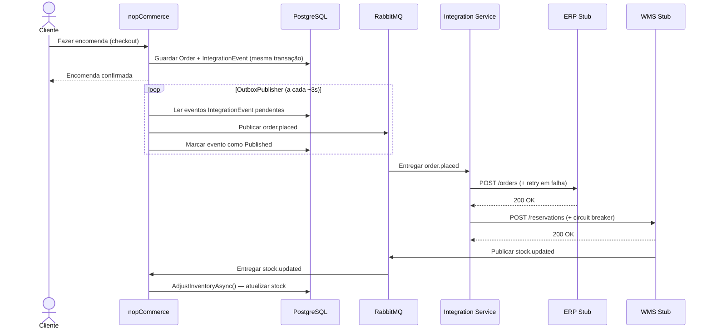
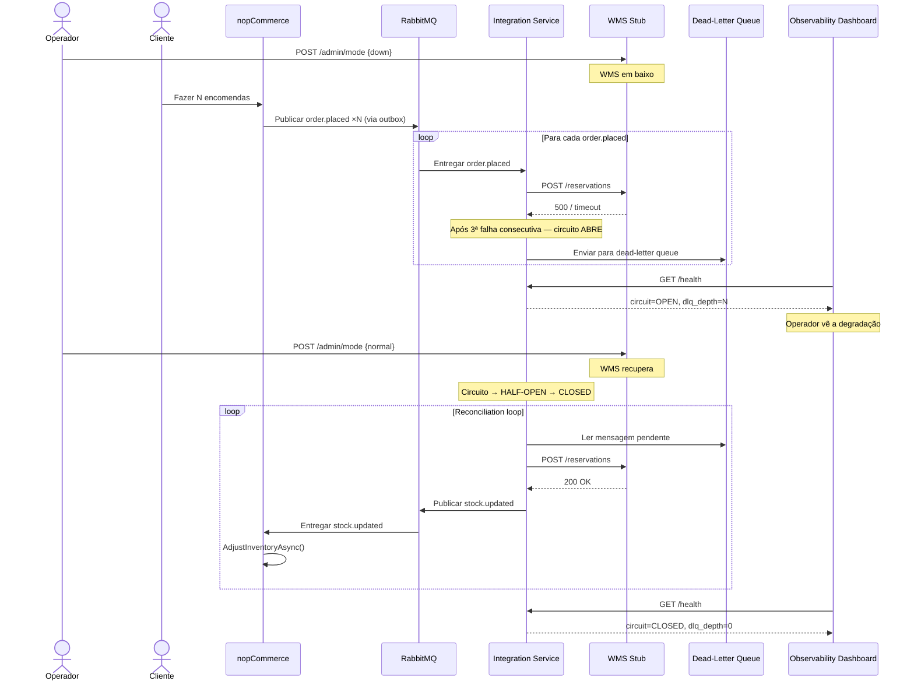

# Resumo do Projeto — Arquitetura de Software (AS)

**Disciplina:** Arquiteturas de Software — Mestrado em Engenharia Informática  
**Docente:** Cláudio Teixeira (claudio@ua.pt)  
**Grupo:** Henrique, Martim, Duarte, Sebastião  
**Peso:** 50% da nota final  
**Cenário escolhido:** Cenário C — Omnichannel Commerce Core (VerdeMart Retail)

---

## 1. O que é este projeto

Este é o Trabalho de Grupo 2 da disciplina de Arquiteturas de Software. O objetivo **não** é construir uma aplicação nova do zero. O objetivo é pegar num sistema real já existente — o **nopCommerce** — e fazê-lo evoluir arquiteturalmente para responder a um cenário de negócio exigente.

O professor avalia principalmente:

- A qualidade das **decisões arquiteturais** e a sua justificação
- A **rastreabilidade** dessas decisões (desde os requisitos de negócio até ao código)
- A capacidade de demonstrar o sistema a funcionar **sob pressão** (falhas, atrasos, recuperação)

O trabalho divide-se em duas partes:

| Parte | Data | Formato | Peso |
|-------|------|---------|------|
| Parte 1 — Architecture Checkpoint | 5–6 de maio de 2026 | Apresentação de 7 minutos | 20% |
| Parte 2 — Entrega Final + Demo | 2–3 de junho de 2026 | Apresentação de 15 minutos com demo ao vivo | 80% |

---

## 2. O que é o nopCommerce

O **nopCommerce** é uma plataforma de e-commerce open-source, escrita em C# com ASP.NET Core 10.0. É um **monólito modular** com uma estrutura em camadas (onion-style):

```
src/Libraries/
  Nop.Core/       — Entidades de domínio (BaseEntity), caching, eventos, helpers
  Nop.Data/       — ORM (LINQ2DB), migrações (FluentMigrator), suporte multi-BD
  Nop.Services/   — 40+ serviços de negócio (Catalog, Orders, Customers, Logging, etc.)

src/Presentation/
  Nop.Web.Framework/  — Infraestrutura MVC partilhada: routing, auth, validators
  Nop.Web/            — Ponto de entrada ASP.NET Core; controllers, Razor views, Program.cs

src/Plugins/        — 30+ plugins dinâmicos (Pagamentos, Expedição, Impostos, Widgets, etc.)
```

No estado base (sem modificações), o nopCommerce:
- Gere o ciclo de vida completo das encomendas (carrinho → checkout → pagamento → confirmação)
- Gere o catálogo de produtos, preços e descontos
- Controla o stock internamente, na sua própria base de dados
- **Não comunica com nenhum sistema externo** — é completamente autónomo

É exatamente este isolamento que o cenário escolhido pretende resolver.

---

## 3. O Cenário Escolhido — Cenário C: Omnichannel Commerce Core

### 3.1 O contexto fictício

A empresa fictícia **VerdeMart Retail** começou com o nopCommerce como loja online. À medida que o negócio cresceu, passou a ter também lojas físicas, um armazém, um sistema ERP para faturação e um sistema de gestão de armazém (WMS). Agora, todos estes sistemas precisam de funcionar em conjunto.

O problema arquitetural não é simplesmente "ligar mais sistemas". O problema é: **como é que o nopCommerce se comporta quando um desses sistemas externos falha, atrasa ou fica indisponível?**

### 3.2 Os dois casos de uso obrigatórios

O enunciado exige a demonstração de dois casos de uso:

**Caso de uso 1 — Compra online / fulfillment por outro canal:**
- O cliente compra na loja online (nopCommerce)
- O ERP deve ser notificado para registo financeiro e faturação
- O WMS deve ser notificado para reserva de stock no armazém
- O nopCommerce confirma a encomenda ao cliente sem esperar pelos sistemas externos

**Caso de uso 2 — Visibilidade de stock entre canais:**
- Uma venda na loja física reduz o stock no armazém (WMS)
- O nopCommerce deve refletir automaticamente o novo nível de stock
- O cliente na loja online vê o stock atualizado

### 3.3 O ponto de pressão obrigatório

O enunciado exige ainda a demonstração de uma falha real com recuperação:

> O WMS fica indisponível. O nopCommerce continua a aceitar encomendas. As mensagens acumulam-se numa fila. Quando o WMS recupera, todas as encomendas são processadas automaticamente — sem perda de dados e sem intervenção manual.

A demonstração deve mostrar:
1. Como a degradação se torna visível (dashboard)
2. Como a arquitetura isola e contém o problema (circuit breaker + dead-letter queue)
3. Como o sistema recupera (reconciliation loop)

---

## 4. A Arquitetura Alvo — Como o Sistema Funciona

### 4.1 Visão geral

O nopCommerce mantém-se como monólito central — **não é decomposto em microserviços**. O que muda é a sua **fronteira de integração**: é adicionada uma camada fina de integração assíncrona que desacopla o nopCommerce dos sistemas externos.

Os componentes do sistema são:

| Componente | Tecnologia | Responsabilidade |
|-----------|-----------|-----------------|
| nopCommerce | ASP.NET Core + PostgreSQL | Commerce core — encomendas, catálogo, clientes, pagamentos |
| RabbitMQ | `rabbitmq:management` Docker | Corretor de mensagens — transporte assíncrono de eventos |
| Order Integration Service | .NET Worker Service | Coordenação entre nopCommerce e ERP/WMS |
| ERP Stub | Serviço HTTP leve | Simula receção de encomendas para faturação |
| WMS Stub | Serviço HTTP leve | Simula reservas de armazém; publica eventos de stock |
| Observability Dashboard | HTML/JS (single-page) | Monitorização ao vivo do estado da integração |

### 4.2 O padrão Outbox (Transactional Outbox Pattern)

Este é o mecanismo central de fiabilidade do sistema. O problema que resolve é o seguinte:

**Sem outbox (problema):**
```
BEGIN TRANSACTION
  INSERT Order
  INSERT OrderItems
COMMIT TRANSACTION
↓
PublishAsync(order.placed)  ← e se isto falhar? A encomenda foi guardada mas o ERP/WMS nunca sabe.
```

Se o RabbitMQ estiver indisponível no momento em que a encomenda é confirmada, o evento perde-se silenciosamente. O ERP e o WMS nunca recebem a notificação. Não há forma de recuperar sem intervenção manual.

**Com outbox (solução):**
```
BEGIN TRANSACTION
  INSERT Order
  INSERT OrderItems
  INSERT IntegrationEvent (status = Pending)  ← atómico com a encomenda
COMMIT TRANSACTION
↓
OutboxPublisherBackgroundService (loop de polling a cada ~3s)
  → lê filas Pending
  → publica no RabbitMQ
  → marca como Published (após confirmação)
  → se falhar, a fila fica Pending e é retentada
```

A encomenda e o evento são escritos **na mesma transação de base de dados**. Se a base de dados confirmar, o evento existe. Se o RabbitMQ estiver em baixo, o evento fica pendente e é publicado logo que o broker esteja disponível. Nunca há perda de eventos.

### 4.3 O fluxo completo — Caso de uso 1 (Happy Path)



### 4.4 O circuit breaker e a recuperação — Ponto de pressão

O **circuit breaker** é um padrão de resiliência que protege o sistema de chamadas repetidas a um serviço indisponível. Funciona como um disjuntor elétrico:

- **Fechado (CLOSED):** tudo normal, as chamadas passam
- **Aberto (OPEN):** após N falhas consecutivas, o circuito abre; as chamadas são bloqueadas e vão para a dead-letter queue
- **Meio-aberto (HALF-OPEN):** após um timeout, o circuito testa com uma chamada; se passar, fecha; se falhar, reabre



### 4.5 Os contratos de mensagem (fixos desde o início)

Para que todos os elementos do grupo possam trabalhar em paralelo, os contratos de mensagem foram definidos e fixados no plano do projeto:

**Evento `order.placed`** (nopCommerce → Integration Service):
```json
{
  "eventId": "uuid",
  "orderId": 123,
  "customerId": 456,
  "items": [{ "productId": 789, "sku": "ABC", "quantity": 2 }],
  "totalAmount": 49.99,
  "occurredAt": "2026-05-10T14:00:00Z"
}
```

**Evento `stock.updated`** (WMS Stub → nopCommerce):
```json
{
  "eventId": "uuid",
  "productId": 789,
  "warehouseId": 1,
  "newStockQuantity": 45,
  "occurredAt": "2026-05-10T14:00:05Z"
}
```

---

## 5. O que há para fazer no total — Divisão de trabalho

### 5.1 Parte 1 — Architecture Checkpoint (entrega: 5–6 maio 2026)

Todos os elementos trabalham em paralelo em documentos independentes:

| Elemento | Ficheiro(s) a produzir | Estado |
|---------|----------------------|--------|
| Henrique | `docs/architecture/current-state-analysis.md` | Completo ✅ |
| Henrique | `docs/architecture/target-architecture.md` | Completo ✅ |
| Martim | `docs/architecture/drivers-and-qa-scenarios.md` | Com TODOs ⚠️ |
| Duarte | `docs/architecture/bounded-contexts.md` | Completo ✅ |
| Duarte | `docs/architecture/evolution-roadmap.md` | Completo ✅ |
| Sebastião | `docs/adr/ADR-001` a `ADR-004` | Completo ✅ |
| Sebastião | `docs/architecture/risk-plan.md` | Completo ✅ |

### 5.2 Parte 2 — Implementação (7 maio → 1 junho 2026)

| Elemento | Componente | O que implementa |
|---------|-----------|-----------------|
| Henrique | nopCommerce (monólito) | Tabela outbox + migration, OutboxPublisherBackgroundService, hook em PlaceOrderAsync, StockUpdateConsumerBackgroundService, endpoint /integration/health |
| Martim | Order Integration Service | Consumer RabbitMQ, ErpAdapter (retry), WmsAdapter (circuit breaker), reconciliation loop, Serilog, /health endpoint |
| Duarte | ERP Stub | Serviço HTTP com POST /orders e POST /admin/mode |
| Duarte | WMS Stub | Serviço HTTP com POST /reservations, GET /stock/{id}, POST /admin/mode; publica stock.updated |
| Duarte | Observability Dashboard | Página HTML/JS com polling de /health, visualização de estado, botões de controlo da demo |
| Duarte | docker-compose.yml | Um único `docker compose up` sobe tudo |
| Sebastião | Testes de integração | Testes end-to-end (happy path + WMS down + recuperação) |
| Sebastião | Relatório de arquitetura | `docs/architecture-report.md` |
| Sebastião | Evidence pack | `docs/evidence/` — logs, screenshots, medições |
| Sebastião | Demo script | `docs/demo-script.md` |

---

## 6. As responsabilidades do Duarte — detalhe completo

O Duarte tem responsabilidades em ambas as partes. Segue uma descrição detalhada de cada uma.

### 6.1 Parte 1 — Documentação de arquitetura

#### 6.1.1 `docs/architecture/bounded-contexts.md`

Este documento define os **contextos delimitados** (bounded contexts) do sistema — ou seja, as fronteiras dentro das quais cada modelo de domínio é válido e coerente.

O conceito vem do **Domain-Driven Design (DDD)**. A ideia fundamental é que em sistemas complexos, a mesma palavra pode significar coisas diferentes em contextos diferentes. Por exemplo, "encomenda" para o nopCommerce é um registo de compra com pagamento e endereço; para o ERP é uma transação financeira a faturar; para o WMS é uma tarefa de picking/packing no armazém. Cada um é um contexto diferente com o seu próprio modelo.

**O que o documento define:**

| Contexto | Sistema | Tipo de subdomínio |
|---------|--------|-------------------|
| Order Management | nopCommerce | Core Domain |
| Catalog & Pricing | nopCommerce | Core Domain |
| Fulfillment Coordination | Order Integration Service | Supporting Subdomain |
| ERP / Back-Office | ERP Stub | Generic Subdomain |
| Warehouse / Inventory | WMS Stub | Supporting Subdomain |

A classificação dos subdomínios é importante porque determina onde investir esforço arquitetural:
- **Core Domain** — é aqui que a VerdeMart compete. Deve ser protegido e bem modelado.
- **Supporting Subdomain** — necessário mas não diferenciador. Pode ser simplificado.
- **Generic Subdomain** — podia ser comprado "off the shelf" (como o SAP ou o Odoo). Não vale a pena investir muito.

O documento inclui também o **context map** — um diagrama que mostra como os contextos se relacionam entre si, com os padrões DDD aplicados a cada relação:

- **Upstream/Downstream** — nopCommerce publica eventos sem saber quem os consome; o Integration Service adapta-se ao schema do upstream
- **Customer/Supplier** — o Integration Service chama o ERP via HTTP; o ERP é o fornecedor
- **Customer/Supplier + Anti-Corruption Layer (ACL)** — o Integration Service chama o WMS, mas o circuit breaker protege o sistema core do comportamento instável do WMS
- **Published Language** — o WMS publica eventos `stock.updated` com um schema bem definido e estável; o nopCommerce consome sem saber nada dos internos do WMS

Por fim, o documento define as **regras de propriedade de dados** — quem é o dono autoritativo de cada dado e como os outros contextos acedem a ele. Nenhum sistema externo escreve diretamente na base de dados do nopCommerce — só através de eventos.

#### 6.1.2 `docs/architecture/evolution-roadmap.md`

Este documento descreve o **caminho de evolução** do estado atual (monólito isolado) até ao estado alvo (commerce core integrado com ERP e WMS), dividido em fases.

Cada fase define:
- O que muda (e apenas isso — sem "big bang")
- O que coexiste durante a transição
- Os atributos de qualidade que cada fase endereça
- As restrições de transição (o que não pode quebrar)

**Fase 0 — Estado atual:**
O nopCommerce funciona completamente isolado. Não notifica nenhum sistema externo. O stock é gerido internamente. Não há visibilidade de integração.

**Fase 1 — Outbox e Message Backbone:**
Adição da tabela `IntegrationEvent` (outbox) ao PostgreSQL do nopCommerce e do `OutboxPublisherBackgroundService`. O nopCommerce escreve eventos na mesma transação que a encomenda. O RabbitMQ é adicionado à infraestrutura. Nesta fase, o nopCommerce funciona normalmente mesmo sem o Integration Service — os eventos acumulam-se na outbox e serão entregues quando um consumidor aparecer.

**Fase 2 — Fulfillment Coordination (Happy Path):**
Implementação do Order Integration Service, dos stubs ERP e WMS, e do `StockUpdateConsumerBackgroundService` no nopCommerce. O fluxo completo funciona: encomenda → ERP + WMS → stock atualizado de volta no nopCommerce.

**Fase 3 — Resiliência e Ponto de Pressão:**
Ativação completa do circuit breaker no WMS adapter, da dead-letter queue, do reconciliation loop e do dashboard de observabilidade. Esta fase é o ponto central da demonstração obrigatória.

O documento inclui também uma tabela de **restrições de transição** (o que não pode ser violado durante nenhuma fase) e uma justificação de **o que fica dentro do monólito e porquê**.

### 6.2 Parte 2 — Implementação

#### 6.2.1 ERP Stub (`services/erp-stub/`)

O ERP Stub é um serviço HTTP leve que simula o comportamento de um sistema ERP para fins de demonstração. Não é um ERP real — o objetivo é criar a pressão arquitetural correta sem a complexidade operacional de instalar o ERPNext ou o Odoo.

**O que implementa:**
- `POST /orders` — recebe e armazena (em memória) a confirmação de uma encomenda; retorna 200 OK em modo normal
- `POST /admin/mode` — permite ao operador colocar o ERP em modo `normal` ou `down` durante a demo

**Porquê não usar o ERPNext real:**
Conforme justificado no ADR-004, um ERPNext real exigiria uma imagem Docker de ~2 GB, base de dados própria, configuração complexa, e não teria capacidade nativa de injeção de falhas. O stub produz a mesma pressão arquitetural com uma imagem de menos de 50 MB e controlo total sobre o comportamento.

#### 6.2.2 WMS Stub (`services/wms-stub/`)

O WMS Stub é o componente mais importante da responsabilidade do Duarte, pois é ele que cria o **ponto de pressão obrigatório** da demonstração.

**O que implementa:**
- `POST /reservations` — recebe uma reserva de stock; em modo normal, confirma e publica um evento `stock.updated` no RabbitMQ
- `GET /stock/{productId}` — devolve o nível de stock atual no armazém
- `POST /admin/mode` — permite ao operador mudar o modo do WMS:
  - `normal` — responde normalmente
  - `slow` — introduz um atraso artificial de vários segundos (simula degradação)
  - `down` — retorna 500 / timeout (simula falha total)

**A interação crítica:** quando o WMS está em modo `down`, o Integration Service recebe erros repetidos, o circuit breaker abre ao 3.º erro consecutivo, e as mensagens vão para a dead-letter queue. Quando o operador coloca o WMS em modo `normal`, o circuit breaker fecha, e o reconciliation loop drena a fila — enviando todas as reservas acumuladas ao WMS e publicando os eventos `stock.updated` correspondentes.

#### 6.2.3 Observability Dashboard (`services/dashboard/`)

O dashboard é uma página web simples (HTML/JavaScript) que funciona como o **centro visual da demonstração**. Sem ele, o ponto de pressão seria invisível para quem está a assistir à apresentação.

**O que mostra (em tempo real, polling a cada 2 segundos):**
- Estado do circuit breaker: `CLOSED` / `OPEN` / `HALF_OPEN`
- Modo atual do WMS: `normal` / `slow` / `down`
- Número de eventos pendentes na outbox do nopCommerce
- Profundidade da dead-letter queue (quantas mensagens estão acumuladas)

**O que permite ao operador fazer:**
- Botões para mudar o modo do WMS (`normal` / `slow` / `down`) diretamente na página — sem ter de abrir um terminal durante a demo

**Porquê é importante:** sem este dashboard, a demo seria cega — o público não veria o circuit breaker abrir, não veria as mensagens a acumular-se, e não veria a recuperação a acontecer. Com o dashboard, o operador pode narrar exatamente o que está a acontecer na arquitetura enquanto acontece.

#### 6.2.4 `docker-compose.yml`

O ficheiro `docker-compose.yml` garante que a demonstração completa pode ser iniciada com **um único comando**:

```bash
docker compose up
```

Este ficheiro orquestra todos os serviços:
- nopCommerce + PostgreSQL
- RabbitMQ (com management UI)
- Order Integration Service
- ERP Stub
- WMS Stub
- Observability Dashboard

**Porquê é importante:** numa demo ao vivo de 15 minutos, não há tempo para iniciar serviços manualmente. Um único `docker compose up` elimina pontos de falha na apresentação e garante que o ambiente é reproduzível por qualquer avaliador.

---

## 7. O que foi feito até agora (pelo Claude Code, a pedido do Duarte)

### 7.1 `docs/architecture/bounded-contexts.md` — completado

**O que existia:** o ficheiro tinha estrutura mas dois TODO markers sem conteúdo real.

**O que foi preenchido:**

**TODO 1 — Classificação de subdomínios:**
Foi adicionado um cabeçalho que define os três tipos de subdomínio (Core, Supporting, Generic) com explicação contextualizada para a VerdeMart. Cada um dos cinco contextos foi expandido com:
- O tipo de subdomínio e a justificação específica (não genérica)
- As entidades-chave que o contexto possui
- As relações com outros contextos
- A nota de isolamento do data store

Exemplo do que foi adicionado ao contexto do WMS:
> "Supporting Subdomain — warehouse execution and stock management are operationally critical but not a differentiator; the value is in the integration, not the WMS itself. (...) this is the mandatory pressure point — the WMS can become slow, unavailable, or contradictory; the architecture must isolate this failure from the Order Management and Catalog contexts"

Isto é importante para a avaliação porque o professor avalia a **qualidade do boundary modeling** — saber que o WMS é Supporting (e não Core) justifica arquiteturalmente por que o isolamos com um circuit breaker em vez de integrar mais profundamente.

**TODO 2 — Context Map:**
O diagrama ASCII foi convertido para **Mermaid** (formato gráfico renderizável no GitHub e em ferramentas de documentação). Foram adicionadas descrições detalhadas de cada relação com os padrões DDD corretos nomeados:

- **Upstream/Downstream** — nopCommerce não conhece os consumidores; o Integration Service adapta-se
- **Customer/Supplier** — Integration Service chama o ERP; relação direta com retry
- **Customer/Supplier + ACL** — o circuit breaker é a camada anti-corrupção que protege o core do comportamento instável do WMS
- **Published Language** — o WMS publica com schema fixo; o nopCommerce consome sem acoplar aos internos do WMS

Estas classificações têm peso na avaliação porque o professor espera que o grupo mostre **domínio de vocabulário DDD** e que as fronteiras sejam arquiteturalmente justificadas.

**TODO 3 (implícito) — Evolution Roadmap:**
O terceiro TODO estava na secção "Evolution Roadmap" dentro do mesmo ficheiro. O texto introdutório do TODO foi removido; o conteúdo das fases já existia e ficou limpo.

### 7.2 `docs/architecture/evolution-roadmap.md` — criado de raiz

Este ficheiro **não existia**. O plano do projeto indicava-o como entrega do Duarte para a Parte 1, mas não tinha sido criado.

**O que foi escrito:**

**Enquadramento (Starting Point and End Goal):**
Uma descrição clara do estado atual vs. estado alvo, e da filosofia de evolução seletiva (não reescrever, não decompor desnecessariamente).

**Fase 0 — Baseline:**
Documenta exatamente o que o nopCommerce é hoje e o que falta do ponto de vista do cenário. Inclui a nota crítica de que sem a evolução, qualquer integração seria síncrona no checkout (acoplaria a experiência do cliente à disponibilidade do WMS).

**Fase 1 — Outbox e Message Backbone:**
Descreve as mudanças concretas ao nopCommerce (tabela `IntegrationEvent`, `OutboxPublisherBackgroundService`, hook em `PlaceOrderAsync`), a infraestrutura adicionada (RabbitMQ, exchanges, DLX), o que coexiste durante a transição, e a restrição de transição crítica: **o write na outbox tem de ser atómico com a encomenda** — se não for, há risco de perda silenciosa de eventos.

**Fase 2 — Fulfillment Coordination:**
Descreve os novos componentes (Integration Service, ERP Stub, WMS Stub, StockUpdateConsumerBackgroundService), com os dois casos de uso obrigatórios representados em diagramas de sequência Mermaid. Cada diagrama mostra o fluxo completo desde o cliente até ao WMS e de volta ao nopCommerce.

**Fase 3 — Resiliência e Ponto de Pressão:**
Descreve o comportamento do circuit breaker, a dead-letter queue, o reconciliation loop e o dashboard. Inclui um diagrama de sequência Mermaid completo da sequência de pressão obrigatória da demo.

**Restrições de transição:**
Uma tabela com cinco restrições que se aplicam a todas as fases — cada uma com a justificação do porquê (p.ex., "o eventId tem de ser propagado end-to-end — necessário para reconciliação idempotente e correlação de logs entre fronteiras de serviço").

**O que fica no monólito e porquê:**
Uma tabela que justifica explicitamente por que o ciclo de encomendas, o catálogo, os clientes e o stock ficam dentro do nopCommerce — responde diretamente a um requisito do enunciado ("Justify what remains inside the monolith and why").

---

## 8. O que falta fazer (estado atual — 3 de maio de 2026)

### Urgente (Parte 1 — apresentação em 2 dias)

- [ ] **Martim** — completar os TODOs em `drivers-and-qa-scenarios.md` (QA-5 + justificação ADD)
- [ ] Todos — rever os documentos da Parte 1 antes da apresentação de 5–6 maio

### Parte 2 (implementação — maio → junho)

- [ ] **Henrique** — implementar integração no monólito (tabela outbox, OutboxPublisher, StockUpdateConsumer, /integration/health)
- [ ] **Martim** — implementar Order Integration Service (.NET Worker, RabbitMQ consumer, ErpAdapter, WmsAdapter, reconciliation, /health)
- [ ] **Duarte** — implementar ERP Stub, WMS Stub, Dashboard e docker-compose.yml
- [ ] **Sebastião** — testes de integração, relatório de arquitetura, evidence pack, demo script

---

## 9. Referências e documentos do projeto

| Documento | Localização | Autor |
|---------|-----------|-------|
| Plano do projeto | `docs/project-plan.md` | Grupo |
| Análise do estado atual | `docs/architecture/current-state-analysis.md` | Henrique |
| Arquitetura alvo | `docs/architecture/target-architecture.md` | Henrique |
| Drivers e cenários QA | `docs/architecture/drivers-and-qa-scenarios.md` | Martim |
| Contextos delimitados | `docs/architecture/bounded-contexts.md` | Duarte |
| Roadmap de evolução | `docs/architecture/evolution-roadmap.md` | Duarte |
| ADR-001 (RabbitMQ vs Kafka) | `docs/adr/ADR-001-messaging-rabbitmq-vs-kafka.md` | Sebastião |
| ADR-002 (Outbox vs Direct Publish) | `docs/adr/ADR-002-reliability-outbox-vs-direct-publish.md` | Sebastião |
| ADR-003 (.NET vs Python) | `docs/adr/ADR-003-integration-service-runtime.md` | Sebastião |
| ADR-004 (Stubs vs Sistemas Reais) | `docs/adr/ADR-004-wms-real-vs-stub.md` | Sebastião |
| Plano de riscos | `docs/architecture/risk-plan.md` | Sebastião |
