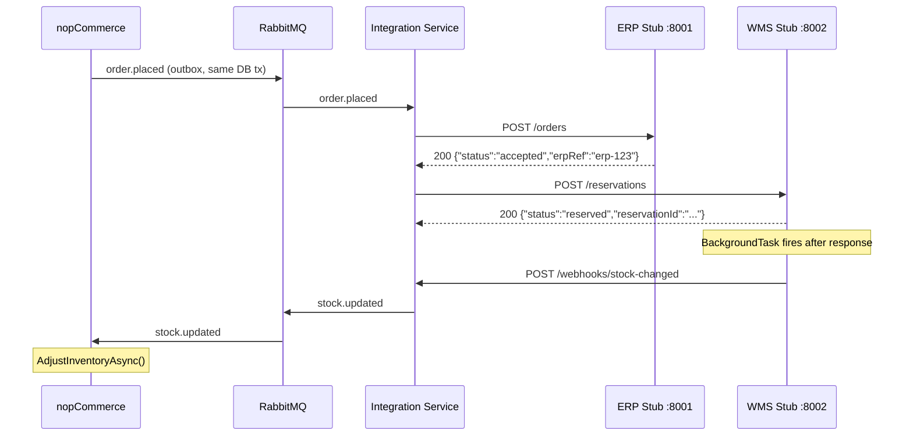
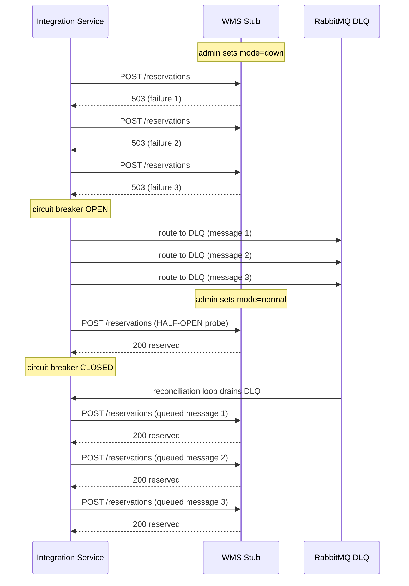

# Services — VerdeMart External System Stubs

This folder contains the independently deployable stub services and (in future weeks) the Order Integration Service that together form the integration layer around nopCommerce.

---

## What Is Implemented

| Service | Folder | Port | Status |
|---------|--------|------|--------|
| ERP Stub | `erp-stub/` | 8001 | Done |
| WMS Stub | `wms-stub/` | 8002 | Done |
| WMS Event Adapter | `wms-event-adapter/` | 8085 | Done |
| Stub Monitor (Dashboard) | `dashboard/` | 8090 | Done |
| Order Integration Service | `order-integration-service/` | 8080 | TODO |

### ERP Stub

Simulates the back-office ERP system that receives orders from the Order Integration Service. Stores all accepted orders in memory and supports switching to a failure mode to trigger the ERP retry scenario (QA-5).

CORS is enabled (`allow_origins=["*"]`) so the browser-based dashboard can call it directly.

**Endpoints:**

| Method | Path | Description |
|--------|------|-------------|
| `POST` | `/orders` | Accept an order. Returns `503` when mode is `down`. |
| `GET` | `/orders` | List all orders received so far. |
| `POST` | `/admin/mode` | Switch mode: `normal` or `down`. |
| `GET` | `/health` | Health check — always `200`, reports mode and order count. |

**Modes:**

| Mode | Behaviour |
|------|-----------|
| `normal` | Accepts orders, stores them, returns `{"status":"accepted","erpRef":"erp-{orderId}"}` |
| `down` | Returns `503 Service Unavailable` on `POST /orders` — triggers the Polly retry in the Integration Service |

**Idempotency:** duplicate requests with the same `eventId` return the cached `erpRef` without adding to the `orders_received` counter. Tracked via `duplicates_skipped`.

### WMS Stub

Simulates the Warehouse Management System that receives stock reservation requests. Maintains an in-memory stock ledger per product. On successful reservation it fires an asynchronous webhook to the Integration Service, which then publishes the `stock.updated` event to RabbitMQ. Supports three failure modes to drive the circuit breaker scenario (QA-1, QA-3).

CORS is enabled (`allow_origins=["*"]`) so the browser-based dashboard can call it directly.

**Endpoints:**

| Method | Path | Description |
|--------|------|-------------|
| `POST` | `/reservations` | Reserve stock for an order. Returns `503` (down) or delays 10 s (slow). |
| `GET` | `/reservations` | List all reservations processed so far. |
| `GET` | `/stock/{productId}` | Query current stock for a product. |
| `POST` | `/admin/mode` | Switch mode: `normal`, `slow`, or `down`. |
| `GET` | `/health` | Health check — always `200`, reports mode and reservation count. |

**Modes:**

| Mode | Behaviour |
|------|-----------|
| `normal` | Reserves stock, fires webhook, returns `{"status":"reserved","reservationId":"..."}` |
| `slow` | Waits **10 seconds** before responding — triggers circuit breaker timeout detection |
| `down` | Returns `503 Service Unavailable` — triggers circuit breaker failure counting |

**Idempotency:** duplicate requests with the same `orderId` return the cached `reservationId` without re-decrementing stock. Tracked via `duplicates_skipped`. The idempotency check runs *before* the slow-mode delay, so retries don't wait 10 s unnecessarily (QA-3).

### WMS Event Adapter

Temporary bridge service that receives stock-change webhooks from the WMS stub and publishes them to RabbitMQ. It exists because the WMS stub needs to notify the message bus after a reservation, but the Integration Service (which will eventually own the `/webhooks/stock-changed` endpoint) is not yet available.

When the Integration Service is deployed, change `STOCK_WEBHOOK_URL` in `docker-compose.yml` to `http://order-integration-service:8080/webhooks/stock-changed` and this service becomes unnecessary.

**Endpoints:**

| Method | Path | Description |
|--------|------|-------------|
| `POST` | `/webhooks/stock-changed` | Receive webhook from WMS stub, publish `stock.updated` to RabbitMQ. |
| `GET` | `/health` | Always `200` — reports `events_published` and `events_failed`. |

**Published message:** routing key `stock.updated` on exchange `verdemart.events` (topic, durable, persistent delivery mode 2).

### Stub Monitor Dashboard

Single-page React app (port 8090) with a dark sidebar and full-width layout. Polls every 3 seconds — no manual refreshes needed.

**Sidebar:** lists ERP Stub and WMS Stub with live pulsing status dots (green = reachable, red = unreachable). Polls both `/health` endpoints every 5 s independently of the page content.

**ERP page (`/erp`):**

| Feature | Description |
|---------|-------------|
| Mode badge | Shows `NORMAL` (green) or `DOWN` (red) — current ERP state |
| Orders Received | Running count of orders accepted since startup |
| Duplicates Skipped | Count of idempotent retries intercepted (QA-5) — turns yellow when > 0 |
| Service Status | `OK` / `DOWN` with colour-coded accent |
| Failure Injection | `Normal` / `Down — 503` buttons + `Reset State` |
| Recent Orders table | Last 10 orders — order ID, event ID, customer, items, total, timestamp |

**WMS page (`/wms`):**

| Feature | Description |
|---------|-------------|
| Integration Service card | Polls `GET :8080/health` — shows circuit breaker state (CLOSED/HALF-OPEN/OPEN), DLQ depth, last processed timestamp. Card turns red when circuit is OPEN. Shows "connecting…" until the Integration Service is up. |
| Mode badge | Shows `NORMAL` (green), `SLOW` (yellow), or `DOWN` (red) |
| Reservations Processed | Running count of reservations since startup |
| Duplicates Skipped | Count of idempotent retries intercepted (QA-3) — turns yellow when > 0 |
| Failure Injection | `Normal` / `Slow — 10s` / `Down — 503` buttons + `Reset State` |
| Stock Lookup | Enter a product ID → shows quantity with colour (green/amber/red) and LOW STOCK / OUT OF STOCK labels |
| Recent Reservations table | Last 10 reservations — reservation ID, order ID, products, stock levels after |

---

## How It Is Implemented

### ERP Stub (`erp-stub/main.py`)

Pure in-memory HTTP service. Global `mode` variable controls rejection behaviour. All endpoints are synchronous (no I/O beyond in-process state). The `/health` and `/admin/mode` endpoints are always available regardless of mode — only the business endpoint `/orders` is affected.

```
Request → mode check → append to orders list → return erpRef
                ↓ (if mode=down)
            HTTP 503
```

### WMS Stub (`wms-stub/main.py`)

Async HTTP service. Global `mode` and `stock` dictionary (productId → quantity). Unknown products default to `DEFAULT_STOCK` (env var, default 100). Stock quantity never goes below 0 (`max(0, current - quantity)`).

The webhook is dispatched using FastAPI's `BackgroundTasks` — the reservation response is returned immediately to the Integration Service, and the webhook call happens afterwards in the background. This means a webhook failure never blocks or fails the reservation.

```
Request → mode check → (optional 10s sleep) → decrement stock →
         schedule webhook (BackgroundTask) → return reservationId
                ↓ (background, after response)
         POST {STOCK_WEBHOOK_URL} with stock.updated payload
         (errors caught and logged, never propagated)
```

**Webhook payload** sent to `STOCK_WEBHOOK_URL` per reserved item:

```json
{
  "eventId": "<uuid>",
  "productId": 789,
  "warehouseId": 1,
  "newStockQuantity": 97,
  "occurredAt": "2026-05-09T10:00:05Z"
}
```

If `STOCK_WEBHOOK_URL` is not set, the webhook step is skipped with a warning log — this allows the WMS stub to run standalone during development without the Integration Service being up.

### Dashboard (`dashboard/src/`)

Vite + React + Tailwind CSS app with two routes served by nginx. No backend — all data comes from direct browser calls to the stub APIs (CORS required, hence the middleware on both stubs).

```
src/
├── App.tsx           — BrowserRouter, dark sidebar, route definitions
├── lib/utils.ts      — cn() helper (clsx + tailwind-merge)
└── pages/
    ├── ErpPage.tsx   — polls /health + /orders every 3s, mode buttons, metric cards
    └── WmsPage.tsx   — polls /health + /reservations + :8080/health every 3s, mode buttons, stock lookup
```

The polling loop uses `setInterval` inside a `useEffect` — cleanup runs on unmount so there are no leaked timers on route change. Mode control buttons call `POST /admin/mode` and rely on the next poll cycle (≤3 s) to reflect the new state in the badge. The Integration Service health poll in `WmsPage` is wrapped in a separate `try/catch` so WMS data never stops updating if the IS is unreachable.

Built with `npm run build` → static files in `dist/` → served by `nginx:alpine` on port 8090.

---

## Tools Used

### Stubs (ERP + WMS)

| Tool | Version | Purpose |
|------|---------|---------|
| Python | 3.12 | Runtime |
| FastAPI | 0.115.0 | HTTP framework — request validation, async support, auto docs at `/docs` |
| Uvicorn | 0.30.0 | ASGI server that runs FastAPI |
| Pydantic | (bundled with FastAPI) | Request/response model validation |
| httpx | 0.27.0 | Async HTTP client used by WMS stub to call the webhook |
| Docker | — | Container packaging (`python:3.12-slim`) |

### WMS Event Adapter

| Tool | Version | Purpose |
|------|---------|---------|
| Python | 3.12 | Runtime |
| FastAPI | 0.115.0 | HTTP framework |
| Uvicorn | 0.30.0 | ASGI server |
| pika | 1.3.2 | RabbitMQ AMQP client (blocking connection, per-request) |
| Docker | — | Container packaging (`python:3.12-slim`) |

### Dashboard

| Tool | Version | Purpose |
|------|---------|---------|
| Node.js | 20 | Build-time runtime |
| Vite | 5.4 | Build tool and dev server |
| React | 18.3 | UI framework |
| React Router | 6.28 | Client-side routing (`/erp`, `/wms`) |
| Tailwind CSS | 3.4 | Utility-first styling |
| clsx + tailwind-merge | 2.x | Conditional class composition (`cn()` helper) |
| lucide-react | 0.460 | Icons |
| nginx | alpine | Serves the static build in production |
| Docker | — | Multi-stage build: Node builder + nginx runner |

---

## How to Run

### Option A — Docker Compose (recommended)

Run the full stub stack (RabbitMQ + WMS Event Adapter + both stubs + dashboard):

```bash
docker compose up --build rabbitmq wms-event-adapter erp-stub wms-stub dashboard
```

Startup order is enforced by `depends_on` with `service_healthy`:
```
rabbitmq → wms-event-adapter → wms-stub → dashboard
                                erp-stub → dashboard
```

Then open **http://localhost:8090** (dashboard) and **http://localhost:15672** (RabbitMQ management, guest/guest).

To run stubs only (no UI, no RabbitMQ):

```bash
docker compose up --build erp-stub wms-stub
```

To run the full stack when all services are ready:

```bash
docker compose up --build
```

### Option B — Local (no Docker)

**Stubs:**
```bash
# Create a virtual environment
python3 -m venv .venv
source .venv/bin/activate
pip install fastapi uvicorn httpx

# Terminal 1 — ERP Stub
cd services/erp-stub
uvicorn main:app --port 8001 --reload

# Terminal 2 — WMS Stub
cd services/wms-stub
STOCK_WEBHOOK_URL=http://localhost:8080/webhooks/stock-changed \
uvicorn main:app --port 8002 --reload
```

**Dashboard (dev server):**
```bash
cd services/dashboard
npm install   # first time only
npm run dev   # opens on http://localhost:5173
```

### Interactive API docs

FastAPI generates interactive documentation automatically:

- ERP Stub: http://localhost:8001/docs
- WMS Stub: http://localhost:8002/docs
- Dashboard: http://localhost:8090

---

## How to Test

All tests below use `curl`. Replace `localhost` with the container name when testing inside Docker network.

### ERP Stub

```bash
# 1. Health check
curl http://localhost:8001/health
# → {"status":"ok","mode":"normal","orders_received":0}

# 2. Submit an order (happy path)
curl -X POST http://localhost:8001/orders \
  -H "Content-Type: application/json" \
  -d '{
    "eventId": "evt-001",
    "orderId": 1,
    "customerId": 42,
    "items": [{"productId": 789, "sku": "ABC", "quantity": 2}],
    "totalAmount": 49.99,
    "occurredAt": "2026-05-09T10:00:00Z"
  }'
# → {"status":"accepted","erpRef":"erp-1"}

# 3. Verify it was stored
curl http://localhost:8001/orders
# → {"count":1,"orders":[...]}

# 4. Trigger failure mode
curl -X POST http://localhost:8001/admin/mode \
  -H "Content-Type: application/json" \
  -d '{"mode":"down"}'
# → {"mode":"down"}

# 5. Confirm orders are rejected (should return 503)
curl -X POST http://localhost:8001/orders \
  -H "Content-Type: application/json" \
  -d '{"eventId":"evt-002","orderId":2,"customerId":42,"items":[{"productId":789,"sku":"ABC","quantity":1}],"totalAmount":24.99,"occurredAt":"2026-05-09T10:01:00Z"}'
# → HTTP 503 {"detail":"ERP unavailable"}

# 6. Restore
curl -X POST http://localhost:8001/admin/mode \
  -H "Content-Type: application/json" \
  -d '{"mode":"normal"}'
```

### WMS Stub

```bash
# 1. Health check
curl http://localhost:8002/health
# → {"status":"ok","mode":"normal","reservations_processed":0}

# 2. Check initial stock (unknown product defaults to 100)
curl http://localhost:8002/stock/789
# → {"productId":789,"quantity":100}

# 3. Reserve stock (happy path)
curl -X POST http://localhost:8002/reservations \
  -H "Content-Type: application/json" \
  -d '{"orderId": 1, "items": [{"productId": 789, "quantity": 3}]}'
# → {"status":"reserved","reservationId":"<uuid>"}

# 4. Verify stock decreased
curl http://localhost:8002/stock/789
# → {"productId":789,"quantity":97}

# 5. Trigger down mode (circuit breaker scenario)
curl -X POST http://localhost:8002/admin/mode \
  -H "Content-Type: application/json" \
  -d '{"mode":"down"}'

curl -X POST http://localhost:8002/reservations \
  -H "Content-Type: application/json" \
  -d '{"orderId": 2, "items": [{"productId": 789, "quantity": 1}]}'
# → HTTP 503 {"detail":"WMS unavailable"}

# 6. Trigger slow mode (timeout scenario — takes 10 seconds)
curl -X POST http://localhost:8002/admin/mode \
  -H "Content-Type: application/json" \
  -d '{"mode":"slow"}'

curl -X POST http://localhost:8002/reservations \
  -H "Content-Type: application/json" \
  -d '{"orderId": 3, "items": [{"productId": 789, "quantity": 1}]}'
# → responds after ~10s → {"status":"reserved","reservationId":"<uuid>"}

# 7. Restore to normal
curl -X POST http://localhost:8002/admin/mode \
  -H "Content-Type: application/json" \
  -d '{"mode":"normal"}'
```

### Demo Pressure Point Script

This is the sequence used to drive the full WMS degradation → recovery demo scenario:

```bash
# Step 1 — confirm normal operation
curl -X POST http://localhost:8002/reservations \
  -H "Content-Type: application/json" \
  -d '{"orderId":10,"items":[{"productId":1,"quantity":1}]}'

# Step 2 — bring WMS down
curl -X POST http://localhost:8002/admin/mode -H "Content-Type: application/json" -d '{"mode":"down"}'

# Step 3 — place 5 orders (Integration Service will hit circuit breaker, route to DLQ)
for i in 1 2 3 4 5; do
  curl -s http://localhost:8001/orders -X POST \
    -H "Content-Type: application/json" \
    -d "{\"eventId\":\"evt-$i\",\"orderId\":$i,\"customerId\":1,\"items\":[{\"productId\":1,\"sku\":\"X\",\"quantity\":1}],\"totalAmount\":9.99,\"occurredAt\":\"2026-05-09T10:0$i:00Z\"}"
done
# Dashboard should show: circuit=OPEN, dlq_depth=5

# Step 4 — restore WMS
curl -X POST http://localhost:8002/admin/mode -H "Content-Type: application/json" -d '{"mode":"normal"}'
# Dashboard should show: circuit=CLOSED, dlq_depth=0 (within 60s)
```

---

## System Flow Diagram

### Happy Path — Order Placed End-to-End



### Pressure Point — WMS Degradation → Recovery



---

## What Must Be Implemented for a Complete Flow

The stubs and dashboard are ready and independently testable. The following components are needed to complete the end-to-end integration:

### 1. Order Integration Service — `services/order-integration-service/`

This is the central connector. Without it, orders from nopCommerce never reach the stubs.

- **RabbitMQ consumer**: subscribe to `verdemart.events` exchange, `order.placed` routing key
- **ERP Adapter**: `POST http://erp-stub:8001/orders` with the `order.placed` payload + Polly exponential backoff (3 retries)
- **WMS Adapter**: `POST http://wms-stub:8002/reservations` + Polly circuit breaker (3 failures → OPEN, 30 s reset timeout)
- **Dead-letter routing**: when circuit is OPEN, push message to `verdemart.dead-letter` queue instead
- **Reconciliation loop**: background service that polls the DLQ and retries when circuit is HALF-OPEN
- **Webhook endpoint**: `POST /webhooks/stock-changed` — receives the WMS stub's webhook call, publishes `stock.updated` to RabbitMQ `verdemart.events`
- **Health endpoint**: `GET /health` — returns circuit state, DLQ depth, last processed event (consumed by Dashboard)

**Contract the stubs expect from the Integration Service:**

`POST http://erp-stub:8001/orders` body:
```json
{
  "eventId": "uuid",
  "orderId": 123,
  "customerId": 456,
  "items": [{ "productId": 789, "sku": "ABC", "quantity": 2 }],
  "totalAmount": 49.99,
  "occurredAt": "2026-05-09T14:00:00Z"
}
```

`POST http://wms-stub:8002/reservations` body:
```json
{
  "orderId": 123,
  "items": [{ "productId": 789, "quantity": 2 }]
}
```

### 2. nopCommerce — Outbox Integration

Without this, no `order.placed` events flow into RabbitMQ.

- Replace `AppStartedEventConsumer` (spike test) with a real hook inside `OrderProcessingService.PlaceOrderAsync()` that writes an `IntegrationEvent` row in the same DB transaction
- Rename `SpikeOutboxPublisherTask` → `OutboxPublisherTask`, make poll interval configurable in `appsettings.json`
- The outbox row must use the `order.placed` routing key and the contract JSON above

### 3. nopCommerce — Stock Update Consumer

Without this, stock levels in nopCommerce are never updated after WMS confirms a reservation.

- New background service subscribing to RabbitMQ `stock.updated` routing key
- Calls `ProductService.AdjustInventoryAsync()` with the new quantity from the webhook payload
- Register in `IntegrationStartup.cs`

---

## Environment Variables Reference

### WMS Stub

| Variable | Default | Description |
|----------|---------|-------------|
| `DEFAULT_STOCK` | `100` | Starting stock quantity for any productId not yet seen |
| `STOCK_WEBHOOK_URL` | *(unset)* | Full URL to call after each reservation, e.g. `http://order-integration-service:8080/webhooks/stock-changed`. If unset, webhook is skipped. |

### ERP Stub

No environment variables — all configuration is via the `/admin/mode` endpoint.

---

## Implementation Checklist

### ERP Stub

- [x] `services/erp-stub/` folder created
- [x] `POST /orders` — accepts order, stores in memory, returns `erpRef`
- [x] `GET /orders` — returns all stored orders for verification
- [x] `POST /admin/mode` — switches between `normal` and `down`
- [x] `GET /health` — always `200`, reports mode and order count
- [x] Mode `down` returns `503` on business endpoints only
- [x] Request validated against `order.placed` contract (Pydantic model)
- [x] CORS middleware (`allow_origins=["*"]`) for dashboard browser calls
- [x] Structured logging with `[ERP]` prefix
- [x] `Dockerfile` (python:3.12-slim, port 8001)
- [x] `requirements.txt` (fastapi, uvicorn)
- [x] Added to `docker-compose.yml` with health check

### WMS Stub

- [x] `services/wms-stub/` folder created
- [x] `POST /reservations` — reserves stock per item, fires webhook, returns `reservationId`
- [x] `GET /reservations` — returns all reservations processed so far
- [x] `GET /stock/{productId}` — returns current quantity (defaults to `DEFAULT_STOCK`)
- [x] `POST /admin/mode` — switches between `normal`, `slow`, and `down`
- [x] `GET /health` — always `200`, reports mode and reservation count
- [x] Mode `down` returns `503` on business endpoints only
- [x] Mode `slow` applies 10 s delay before processing
- [x] Stock ledger — per-product quantity, never goes below 0
- [x] Unknown products default to `DEFAULT_STOCK` (env var)
- [x] Webhook dispatched via `BackgroundTasks` (non-blocking, fire-and-forget)
- [x] Webhook errors caught and logged — never fail the reservation response
- [x] `STOCK_WEBHOOK_URL` configurable via env var; skipped gracefully if unset
- [x] Webhook payload matches `stock.updated` contract
- [x] CORS middleware (`allow_origins=["*"]`) for dashboard browser calls
- [x] Structured logging with `[WMS]` prefix
- [x] `Dockerfile` (python:3.12-slim, port 8002)
- [x] `requirements.txt` (fastapi, uvicorn, httpx)
- [x] Added to `docker-compose.yml` with health check and env vars

### WMS Event Adapter

- [x] `services/wms-event-adapter/` folder created
- [x] `POST /webhooks/stock-changed` — receives WMS webhook, publishes `stock.updated` to RabbitMQ
- [x] `GET /health` — reports `events_published` and `events_failed`
- [x] Exchange declared as topic, durable; messages published with `delivery_mode=2` (persistent)
- [x] `RABBITMQ_URL` configurable via env var
- [x] Structured logging with `[WMS-ADAPTER]` prefix
- [x] `Dockerfile` (python:3.12-slim, port 8085)
- [x] `requirements.txt` (fastapi, uvicorn, pika)
- [x] Added to `docker-compose.yml` with `depends_on: rabbitmq (service_healthy)`

### Stub Monitor Dashboard

- [x] `services/dashboard/` folder created (Vite + React + Tailwind)
- [x] Dark sidebar with pulsing status dots per service
- [x] `/erp` route — ERP page with live data and mode controls
- [x] `/wms` route — WMS page with live data, mode controls, and stock lookup
- [x] Auto-refresh polling every 3 seconds (setInterval, cleanup on unmount)
- [x] Mode badge — green/yellow/red indicator per current stub mode
- [x] Metric cards with colour-coded accent bars (default/warning/danger/success)
- [x] Duplicates Skipped counter (ERP + WMS) — turns yellow when > 0
- [x] Integration Service card (WMS page) — circuit breaker state, DLQ depth, last processed (polls `:8080/health`, silent failure)
- [x] Failure injection buttons — switch modes directly from the browser
- [x] Reset State button (ERP + WMS) — clears all in-memory state for clean demo runs
- [x] Orders table (ERP) — last 10 orders, most recent first
- [x] Reservations table (WMS) — last 10 reservations with stock-after values
- [x] Stock lookup (WMS) — colour-coded quantity with LOW STOCK / OUT OF STOCK labels
- [x] Error banner when stub is unreachable
- [x] `src/lib/utils.ts` — `cn()` helper (clsx + tailwind-merge)
- [x] `Dockerfile` — multi-stage: Node 20 builder + nginx:alpine runner, port 8090
- [x] `nginx.conf` — SPA routing (`try_files` fallback to `index.html`)
- [x] Added to `docker-compose.yml` with `depends_on: [erp-stub (healthy), wms-stub (healthy)]`

### Docker Compose

- [x] `rabbitmq` service — health check (`rabbitmq-diagnostics ping`)
- [x] `erp-stub` service — build, port 8001, health check
- [x] `wms-event-adapter` service — build, port 8085, `RABBITMQ_URL` env var, `depends_on: rabbitmq (service_healthy)`
- [x] `wms-stub` service — build, port 8002, health check, `DEFAULT_STOCK` + `STOCK_WEBHOOK_URL` env vars, `depends_on: wms-event-adapter (service_healthy)`
- [x] `dashboard` service — build, port 8090, `depends_on: erp-stub + wms-stub (service_healthy)`
- [ ] `order-integration-service` — pending
